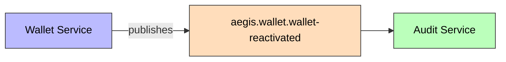
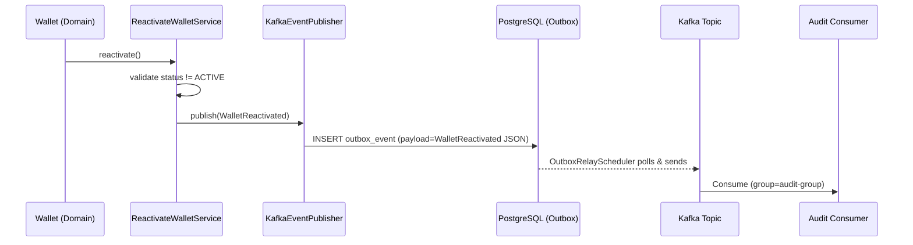

> **Status: Planned** — This event is documented but not yet implemented in code. The wallet reactivation flow exists but does not yet publish a domain event.

# WalletReactivated

Published when a CLOSED or FROZEN wallet is reactivated.

## Schema

| Field | Type | Description |
|-------|------|-------------|
| `walletId` | UUID | Wallet's ID |
| `userId` | UUID | Owner's ID |
| `previousStatus` | String | Status before reactivation (CLOSED/FROZEN) |
| `newStatus` | String | Always ACTIVE |
| `timestamp` | Instant | Event time |

## Details

- **Producer**: [[01 - Services/Wallet Service\|Wallet Service]] via [[04 - Ports/outbound/EventPublisher\|EventPublisher]]
- **Topic**: `aegis.wallet.wallet-reactivated` ([[05 - Infrastructure/Kafka Topics\|Kafka Topics]])
- **Trigger**: `Wallet.reactivate()`
