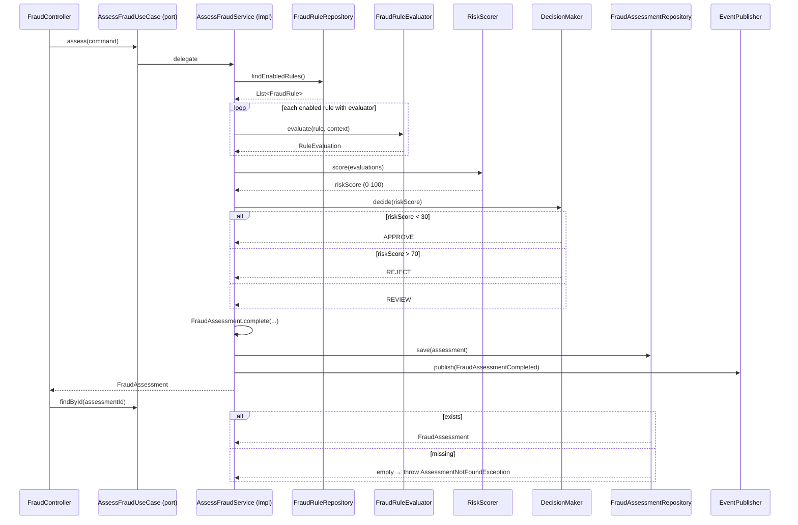

# AssessFraudUseCase

Inbound port (interface) for fraud assessment.



## Methods

```java
FraudAssessment assess(AssessmentCommand command);
FraudAssessment findById(UUID assessmentId);
```

## Command

```java
record AssessmentCommand(UUID transactionId, String transactionType, BigDecimal amount,
                         String currency, UUID sourceWalletId, UUID destWalletId,
                         UUID userId, String countryCode) {}
```

## Behavior

1. Loads enabled rules from [[04 - Ports/outbound/FraudRuleRepository|FraudRuleRepository]]
2. Evaluates each rule via the matching `FraudRuleEvaluator` by [[02 - Domain Models/FraudRule|RuleType]]
3. Aggregates scores with `RiskScorer` (0-100)
4. Applies thresholds with `DecisionMaker` (APPROVE < 30, REVIEW 30-70, REJECT > 70)
5. Persists [[02 - Domain Models/FraudAssessment|FraudAssessment]] via [[04 - Ports/outbound/FraudAssessmentRepository|FraudAssessmentRepository]]
6. Publishes [[03 - Domain Events/FraudAssessmentCompleted|FraudAssessmentCompleted]] via [[04 - Ports/outbound/EventPublisher|EventPublisher]]

## Implementation

- **Implemented by**: `AssessFraudService` in [[01 - Services/Fraud Service|Fraud Service]]
- **Exposed by**: `FraudController` (`POST /api/v1/fraud/assess`, `GET /api/v1/fraud/assessments/{id}`)
