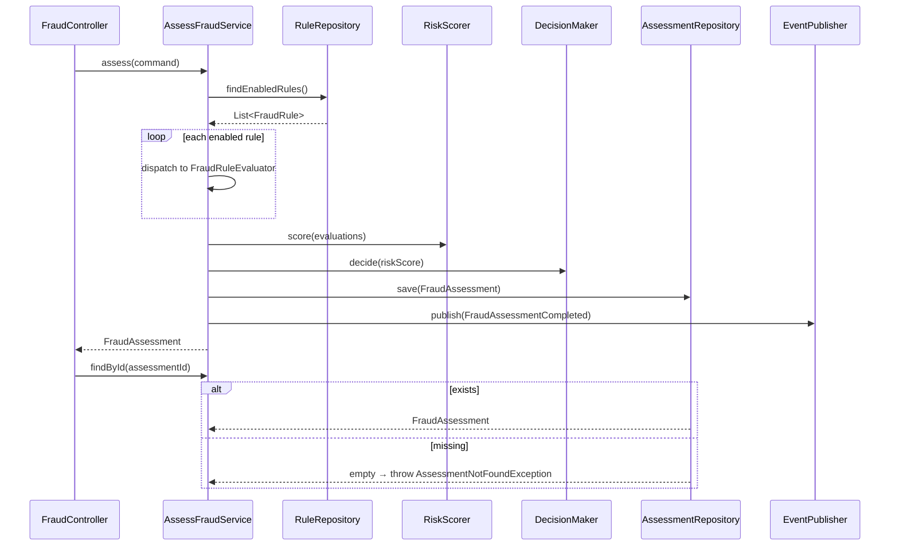

# AssessFraudUseCase

Inbound port (interface) for fraud assessment.



## Methods

```java
FraudAssessment assess(AssessmentCommand command);

FraudAssessment findById(UUID assessmentId);
```

## Behavior

1. Loads enabled rules from `FraudRuleRepository`
2. Evaluates each rule via the matching `FraudRuleEvaluator`
3. Aggregates scores with `RiskScorer` (0-100)
4. Applies thresholds with `DecisionMaker` (APPROVE < 30, REVIEW 30-70, REJECT > 70)
5. Persists `FraudAssessment`
6. Publishes [[03 - Domain Events/FraudAssessmentCompleted\|FraudAssessmentCompleted]]

## Implementation

- **Implemented by**: `AssessFraudService` in [[01 - Services/Fraud Service\|Fraud Service]]
- **Exposed by**: `FraudController` (`POST /api/v1/fraud/assess`, `GET /api/v1/fraud/assessments/{id}`)
