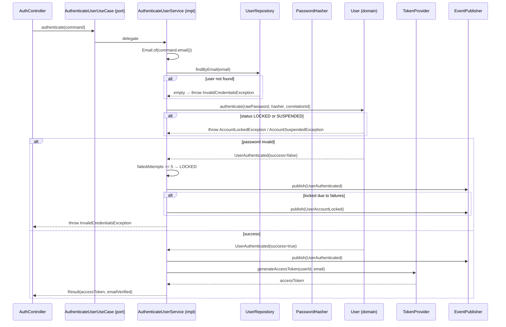

# AuthenticateUserUseCase

Inbound port (interface) for user login.



## Method

```java
Result authenticate(Command command);
```

## Command / Result

```java
record Command(String email, String password, String correlationId) {}
record Result(String accessToken, boolean emailVerified) {}
```

## Behavior

1. Finds user by email via [[04 - Ports/outbound/UserRepository|UserRepository]]
2. Verifies password via [[04 - Ports/outbound/PasswordHasher|PasswordHasher]]
3. Tracks failed attempts (locks after 5, 15 min lockout)
4. Publishes [[03 - Domain Events/UserAuthenticated|UserAuthenticated]] on success AND failure (with `success` flag)
5. Publishes [[03 - Domain Events/UserAccountLocked|UserAccountLocked]] when the account becomes locked
6. Generates an access token via [[04 - Ports/outbound/TokenProvider|TokenProvider]]

## Implementation

- **Implemented by**: `AuthenticateUserService` in [[01 - Services/Identity Service|Identity Service]]
- **Exposed by**: `AuthController` (`POST /api/v1/auth/login`)
