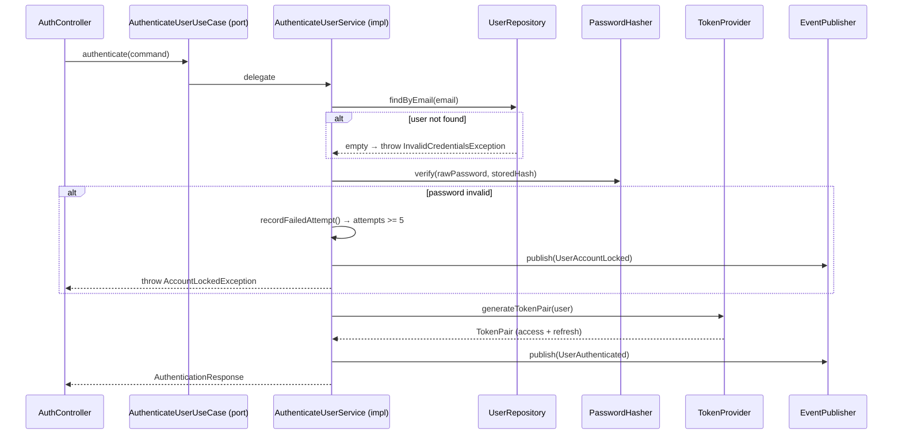

# AuthenticateUserUseCase

Inbound port (interface) for user login.



## Method

```java
AuthenticationResponse authenticate(AuthenticateUserCommand command);
```

## Behavior

1. Finds user by email via [[04 - Ports/outbound/UserRepository\|UserRepository]]
2. Verifies password via [[04 - Ports/outbound/PasswordHasher\|PasswordHasher]]
3. Generates JWT tokens via [[04 - Ports/outbound/TokenProvider\|TokenProvider]]
4. Tracks failed attempts (locks after 5)
5. Publishes [[03 - Domain Events/UserAuthenticated\|UserAuthenticated]] or [[03 - Domain Events/UserAccountLocked\|UserAccountLocked]]

## Implementation

- **Implemented by**: `AuthenticateUserService` in [[01 - Services/Identity Service\|Identity Service]]
- **Exposed by**: `AuthController` (`POST /api/v1/auth/login`)
