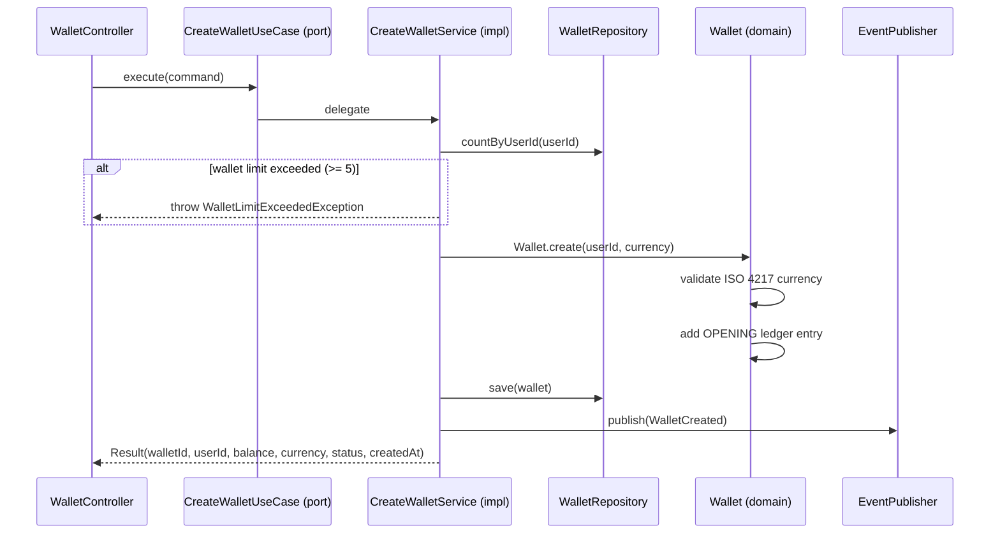

# CreateWalletUseCase

Inbound port (interface) for wallet creation.



## Method

```java
Result execute(Command command);
```

## Command / Result

```java
record Command(UUID userId, String currency, String correlationId) {}
record Result(UUID walletId, UUID userId, BigDecimal balance, String currency,
              String status, Instant createdAt) {}
```

## Behavior

1. Validates per-user wallet limit (max 5) via [[04 - Ports/outbound/WalletRepository|WalletRepository]]
2. Creates [[02 - Domain Models/Wallet|Wallet]] aggregate via factory method (validates ISO 4217 currency)
3. Persists via [[04 - Ports/outbound/WalletRepository|WalletRepository]]
4. Publishes [[03 - Domain Events/WalletCreated|WalletCreated]] via [[04 - Ports/outbound/EventPublisher|EventPublisher]]

## Implementation

- **Implemented by**: `CreateWalletService` in [[01 - Services/Wallet Service|Wallet Service]]
- **Exposed by**: `WalletController` (`POST /api/v1/wallets`)
