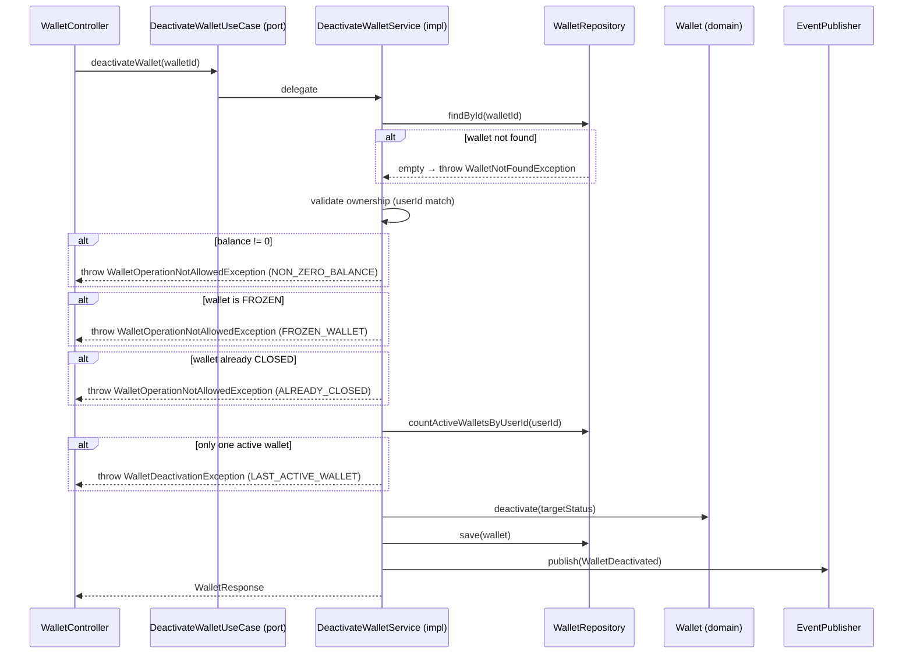

# DeactivateWalletUseCase

Inbound port (interface) for wallet deactivation.



## Method

```java
WalletResponse deactivateWallet(UUID walletId);
```

## Business Rules (CRITICAL)

1. Balance must be exactly €0.00
2. User must have at least ONE other active wallet
3. FROZEN wallets cannot be deactivated directly (must reactivate first)
4. Already CLOSED wallets cannot be deactivated again

Violations throw `WalletDeactivationException` with a specific reason code.

## Implementation

- **Implemented by**: `DeactivateWalletService` in [[01 - Services/Wallet Service\|Wallet Service]]
- **Exposed by**: `WalletController` (`POST /api/v1/wallets/{id}/deactivate`)
- **Validates via**: [[04 - Ports/outbound/WalletRepository\|WalletRepository]] (countActiveWalletsByUserId)
