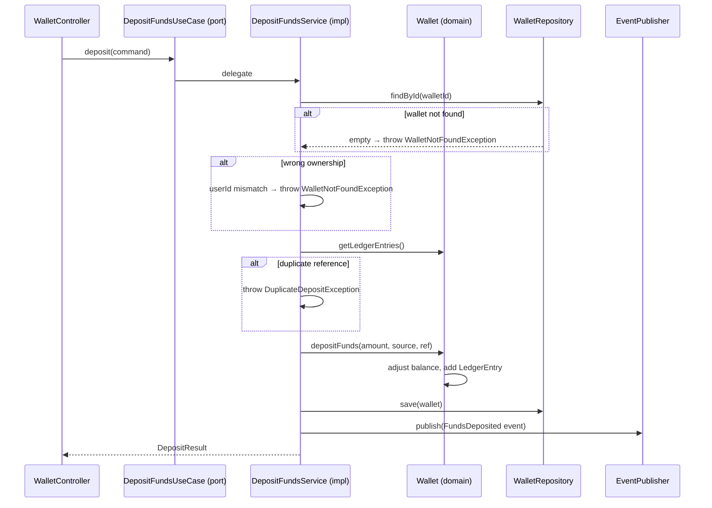

# DepositFundsUseCase

Inbound port (interface) for depositing funds into a wallet.



## Method

```java
DepositResult deposit(DepositCommand command);
```

## Behavior

1. Validates wallet exists and belongs to the user
2. Checks idempotency (rejects duplicate external references)
3. Validates wallet is ACTIVE and amount is positive
4. Updates wallet balance and creates DEPOSIT ledger entry
5. Persists via [[04 - Ports/outbound/WalletRepository\|WalletRepository]]
6. Publishes [[03 - Domain Events/FundsDeposited\|FundsDeposited]] via [[04 - Ports/outbound/EventPublisher\|EventPublisher]]

## Implementation

- **Implemented by**: `DepositFundsService` in [[01 - Services/Wallet Service\|Wallet Service]]
- **Exposed by**: `WalletController` (`POST /api/v1/wallets/{id}/deposits`)
