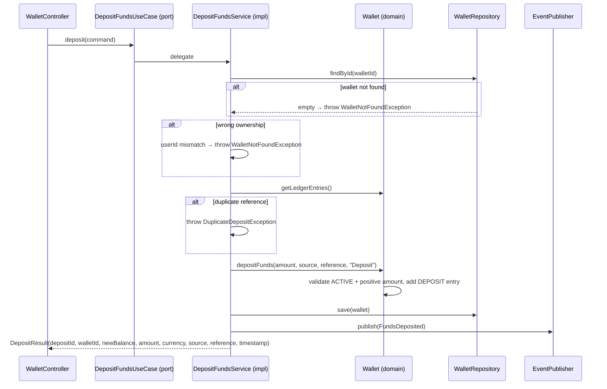

# DepositFundsUseCase

Inbound port (interface) for depositing funds into a wallet.



## Method

```java
DepositResult deposit(DepositCommand command);
```

## Command / Result

```java
record DepositCommand(UUID walletId, UUID userId, BigDecimal amount, String currency,
                      String source, String reference, String correlationId) {}
record DepositResult(UUID depositId, UUID walletId, BigDecimal newBalance, BigDecimal amount,
                     String currency, String source, String reference, Instant timestamp) {}
```

## Behavior

1. Validates wallet exists and belongs to the user ([[04 - Ports/outbound/WalletRepository|WalletRepository]])
2. Checks idempotency (rejects duplicate external references; DB unique partial index as race-condition guard)
3. Validates wallet is ACTIVE and amount is positive
4. Updates wallet balance and creates a DEPOSIT ledger entry
5. Persists via [[04 - Ports/outbound/WalletRepository|WalletRepository]]
6. Publishes [[03 - Domain Events/FundsDeposited|FundsDeposited]] via [[04 - Ports/outbound/EventPublisher|EventPublisher]]

## Implementation

- **Implemented by**: `DepositFundsService` in [[01 - Services/Wallet Service|Wallet Service]]
- **Exposed by**: `WalletController` (`POST /api/v1/wallets/{id}/deposits`)
