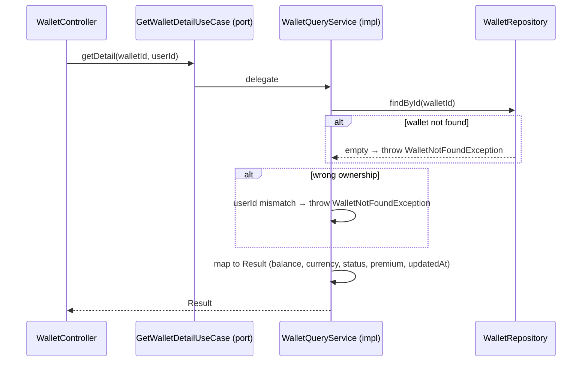

# GetWalletDetailUseCase

Inbound port (interface) for retrieving the detail of a single wallet, validating ownership.



## Method

```java
Result getDetail(UUID walletId, UUID userId);
```

## Result

```java
record Result(UUID walletId, UUID userId, BigDecimal balance, String currency,
              String status, boolean premium, Instant createdAt, Instant updatedAt) {}
```

## Behavior

1. Finds the wallet via [[04 - Ports/outbound/WalletRepository|WalletRepository]]
2. Validates ownership — a missing wallet or a userId mismatch both throw `WalletNotFoundException`
3. Maps [[02 - Domain Models/Wallet|Wallet]] to a `Result` including the [[02 - Domain Models/Wallet|isPremium()]] flag
4. No domain events are published

## Implementation

- **Implemented by**: `WalletQueryService` in [[01 - Services/Wallet Service|Wallet Service]]
- **Exposed by**: `WalletController` (`GET /api/v1/wallets/{walletId}`)
