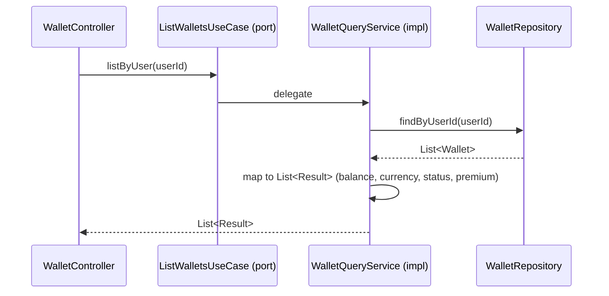

# ListWalletsUseCase

Inbound port (interface) for listing the wallets belonging to a user.



## Method

```java
List<Result> listByUser(UUID userId);
```

## Result

```java
record Result(UUID walletId, UUID userId, BigDecimal balance, String currency,
              String status, boolean premium, Instant createdAt) {}
```

## Behavior

1. Queries wallets via [[04 - Ports/outbound/WalletRepository|WalletRepository]] (`findByUserId`)
2. Maps each [[02 - Domain Models/Wallet|Wallet]] to a summary `Result` including the [[02 - Domain Models/Wallet|isPremium()]] flag
3. Returns an empty list when the user has no wallets; no domain events are published

## Implementation

- **Implemented by**: `WalletQueryService` in [[01 - Services/Wallet Service|Wallet Service]]
- **Exposed by**: `WalletController` (`GET /api/v1/wallets`)
