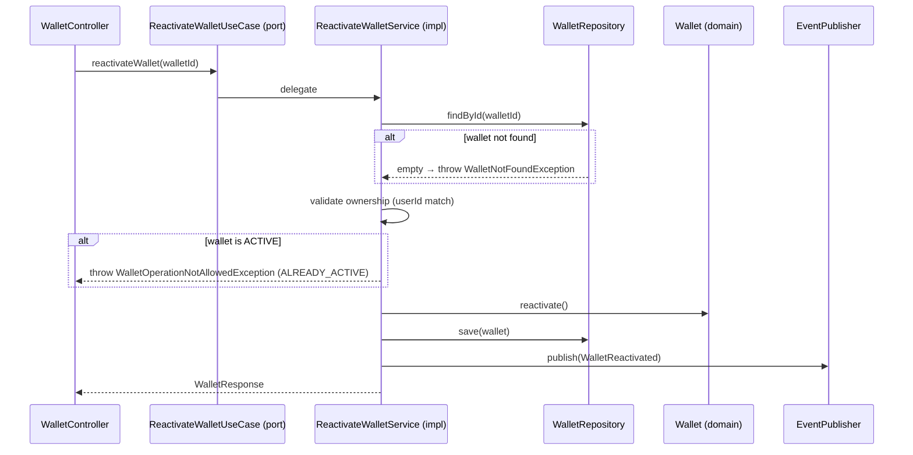

# ReactivateWalletUseCase

Inbound port (interface) for wallet reactivation.



## Method

```java
WalletResponse reactivateWallet(UUID walletId);
```

## Behavior

- CLOSED wallets → ACTIVE
- FROZEN wallets → ACTIVE
- Already ACTIVE wallets → throws exception

## Implementation

- **Implemented by**: `ReactivateWalletService` in [[01 - Services/Wallet Service\|Wallet Service]]
- **Exposed by**: `WalletController` (`POST /api/v1/wallets/{id}/reactivate`)
