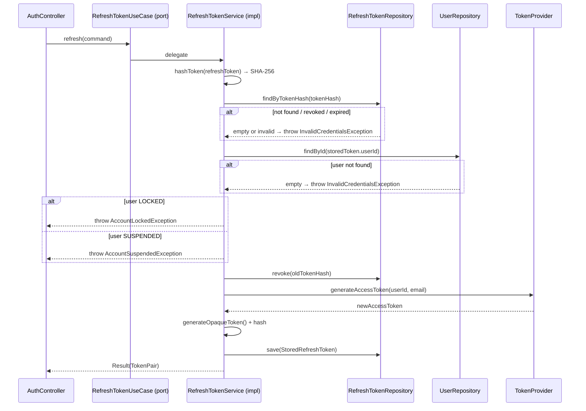

# RefreshTokenUseCase

Inbound port (interface) for refreshing an access token using a valid opaque refresh token. Implements refresh token rotation: the old token is revoked and a new token pair is issued.



## Method

```java
Result refresh(Command command);
```

## Command / Result

```java
record Command(String refreshToken, String correlationId) {}
record Result(TokenPair tokenPair) {}
```

## Behavior

1. Hashes the opaque refresh token (SHA-256) and looks it up via [[04 - Ports/outbound/RefreshTokenRepository|RefreshTokenRepository]]
2. Rejects revoked, expired, or unknown tokens with `InvalidCredentialsException`
3. Rejects LOCKED / SUSPENDED users with `AccountLockedException` / `AccountSuspendedException`
4. Revokes the old token and persists a new opaque refresh token (rotation)
5. Generates a new access token via [[04 - Ports/outbound/TokenProvider|TokenProvider]]
6. Returns a new [[02 - Domain Models/TokenPair|TokenPair]]; no domain events are published

## Implementation

- **Implemented by**: `RefreshTokenService` in [[01 - Services/Identity Service|Identity Service]]
- **Exposed by**: `AuthController` (`POST /api/v1/auth/refresh`)
