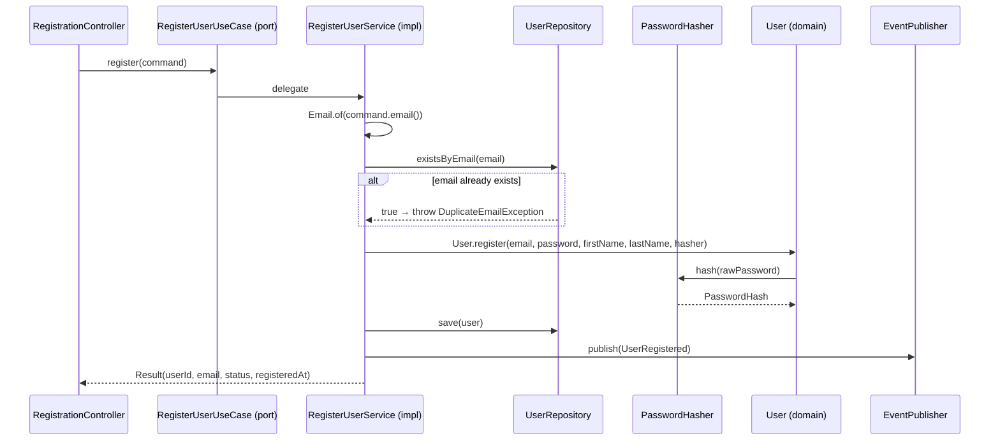

# RegisterUserUseCase

Inbound port (interface) for user registration.



## Method

```java
Result register(Command command);
```

## Command / Result

```java
record Command(String email, String password, String firstName, String lastName, String correlationId) {}
record Result(UUID userId, String email, String status, Instant registeredAt) {}
```

## Behavior

1. Validates the raw password via [[02 - Domain Models/Password|Password]] value object (throws `WeakPasswordException`)
2. Checks email uniqueness via [[04 - Ports/outbound/UserRepository|UserRepository]]
3. Hashes password via [[04 - Ports/outbound/PasswordHasher|PasswordHasher]]
4. Creates [[02 - Domain Models/User|User]] aggregate via factory method (PENDING_VERIFICATION)
5. Persists via [[04 - Ports/outbound/UserRepository|UserRepository]]
6. Publishes [[03 - Domain Events/UserRegistered|UserRegistered]] via [[04 - Ports/outbound/EventPublisher|EventPublisher]]

## Implementation

- **Implemented by**: `RegisterUserService` in [[01 - Services/Identity Service|Identity Service]]
- **Exposed by**: `RegistrationController` (`POST /api/v1/users/register`)
