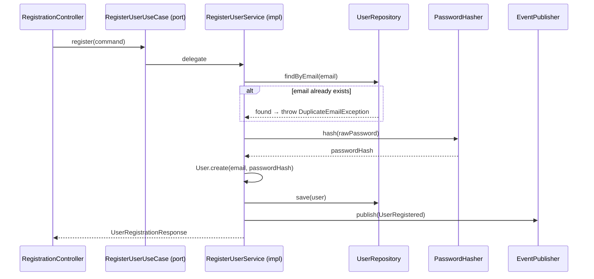

# RegisterUserUseCase

Inbound port (interface) for user registration.



## Method

```java
UserRegistrationResponse register(RegisterUserCommand command);
```

## Behavior

1. Validates email uniqueness via [[04 - Ports/outbound/UserRepository\|UserRepository]]
2. Hashes password via [[04 - Ports/outbound/PasswordHasher\|PasswordHasher]]
3. Creates [[02 - Domain Models/User\|User]] aggregate via factory method
4. Persists via [[04 - Ports/outbound/UserRepository\|UserRepository]]
5. Publishes [[03 - Domain Events/UserRegistered\|UserRegistered]] via [[04 - Ports/outbound/EventPublisher\|EventPublisher]]

## Implementation

- **Implemented by**: `RegisterUserService` in [[01 - Services/Identity Service\|Identity Service]]
- **Exposed by**: `RegistrationController` (`POST /api/v1/users/register`)
