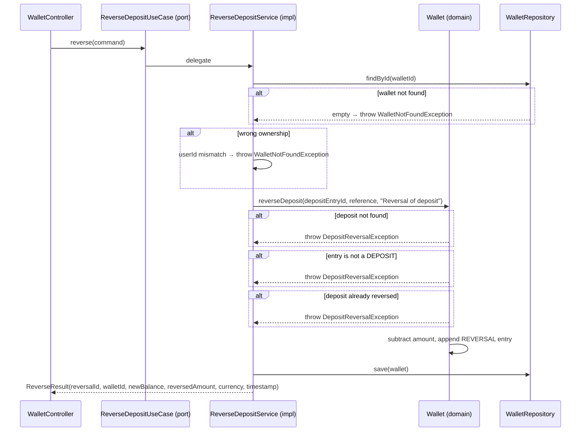

# ReverseDepositUseCase

Inbound port (interface) for reversing a previously applied deposit by appending an immutable REVERSAL ledger entry (ADR-004). The original DEPOSIT entry is never modified.



## Method

```java
ReverseResult reverse(ReverseCommand command);
```

## Command / Result

```java
record ReverseCommand(UUID walletId, UUID userId, UUID depositEntryId,
                      String reference, String correlationId) {}
record ReverseResult(UUID reversalId, UUID walletId, BigDecimal newBalance,
                     BigDecimal reversedAmount, String currency, Instant timestamp) {}
```

## Behavior

1. Finds the wallet and validates ownership via [[04 - Ports/outbound/WalletRepository|WalletRepository]]
2. Validates the wallet is ACTIVE and the entry is a DEPOSIT that is not already reversed
3. Reverses via `Wallet.reverseDeposit` → appends an immutable [[02 - Domain Models/LedgerEntryType|REVERSAL]] entry referencing the original [[02 - Domain Models/LedgerEntry|LedgerEntry]]
4. Persists via [[04 - Ports/outbound/WalletRepository|WalletRepository]]
5. Returns the reversal receipt; no domain events are published

## Implementation

- **Implemented by**: `ReverseDepositService` in [[01 - Services/Wallet Service|Wallet Service]]
- **Exposed by**: `WalletController` (`POST /api/v1/wallets/{id}/deposits/{depositId}/reversal`)
