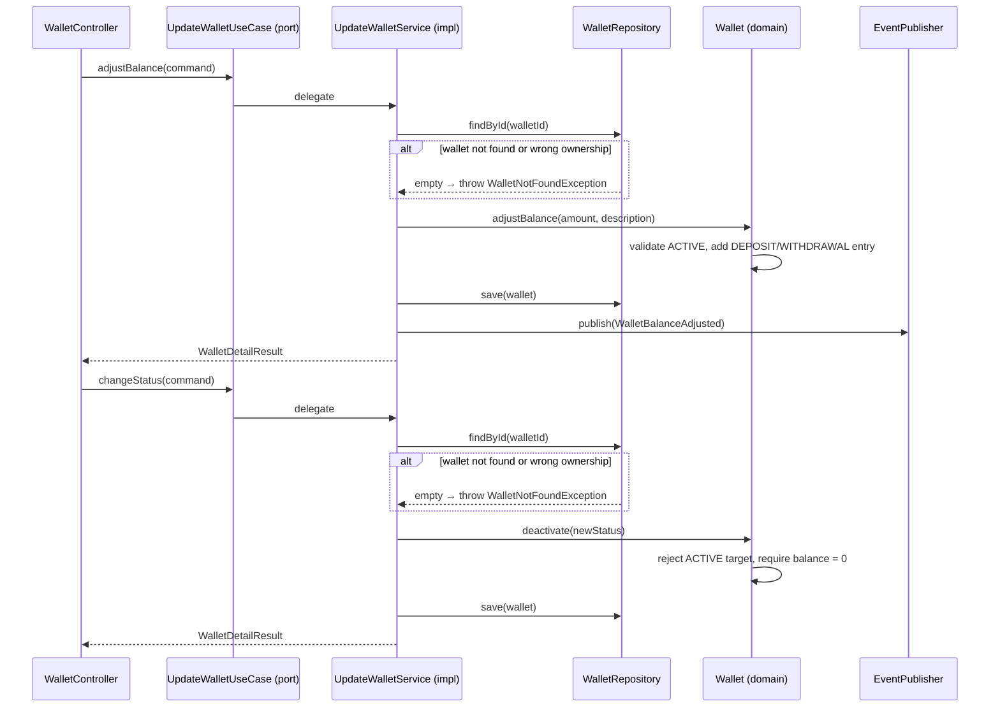

# UpdateWalletUseCase

Inbound port (interface) for managing an existing wallet — adjusting the balance and changing its status.



## Methods

```java
WalletDetailResult adjustBalance(AdjustBalanceCommand command);
WalletDetailResult changeStatus(StatusChangeCommand command);
```

## Commands / Result

```java
record AdjustBalanceCommand(UUID walletId, UUID userId, BigDecimal amount,
                            String description, String correlationId) {}
record StatusChangeCommand(UUID walletId, UUID userId, WalletStatus newStatus) {}
record WalletDetailResult(UUID walletId, UUID userId, BigDecimal balance, String currency,
                          String status, boolean premium, Instant createdAt, Instant updatedAt) {}
```

## Behavior

1. Finds wallet and validates ownership via [[04 - Ports/outbound/WalletRepository|WalletRepository]]
2. `adjustBalance` → validates wallet is ACTIVE, applies the amount, creates a DEPOSIT/WITHDRAWAL entry
3. `adjustBalance` publishes [[03 - Domain Events/WalletBalanceAdjusted|WalletBalanceAdjusted]] via [[04 - Ports/outbound/EventPublisher|EventPublisher]]
4. `changeStatus` → validates zero balance and target ≠ ACTIVE (FROZEN or CLOSED); no event published
5. Persists via [[04 - Ports/outbound/WalletRepository|WalletRepository]]

## Implementation

- **Implemented by**: `UpdateWalletService` in [[01 - Services/Wallet Service|Wallet Service]]
- **Exposed by**: `WalletController` (`PATCH /api/v1/wallets/{id}/balance`, `PATCH /api/v1/wallets/{id}/status`)
