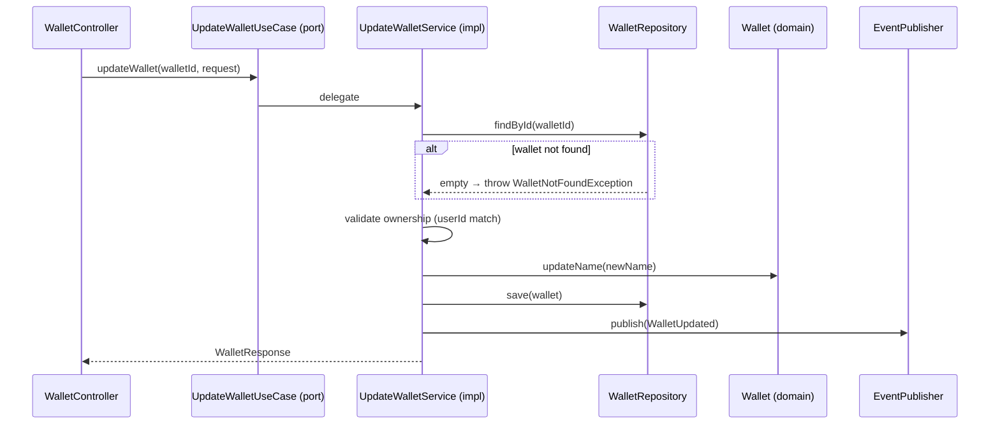

# UpdateWalletUseCase

Inbound port (interface) for updating wallet name/alias.



## Method

```java
WalletResponse updateWallet(UUID walletId, UpdateWalletRequest request);
```

## Behavior

1. Finds wallet via [[04 - Ports/outbound/WalletRepository\|WalletRepository]]
2. Validates ownership (wallet belongs to requesting user)
3. Updates wallet name
4. Persists changes
5. Publishes [[03 - Domain Events/WalletUpdated\|WalletUpdated]]

## Implementation

- **Implemented by**: `UpdateWalletService` in [[01 - Services/Wallet Service\|Wallet Service]]
- **Exposed by**: `WalletController` (`PATCH /api/v1/wallets/{id}`)
