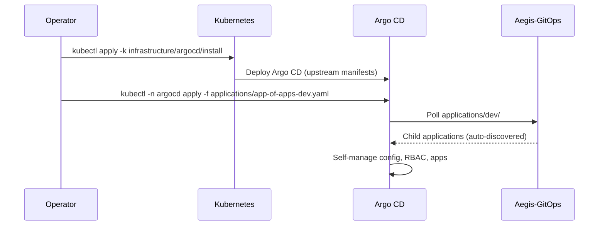
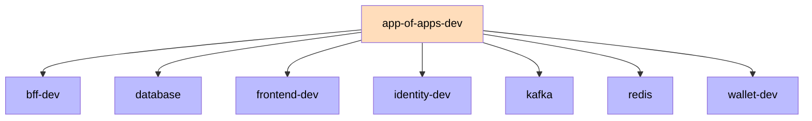
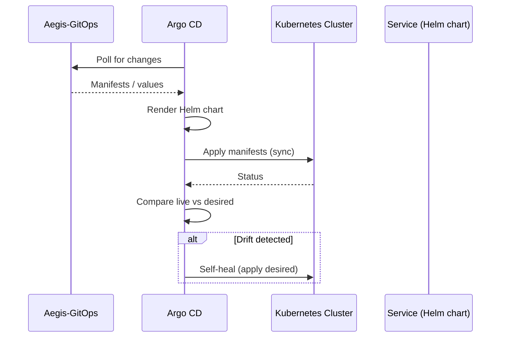

# Argo CD

Argo CD is the GitOps engine of the Aegis platform. It is bootstrapped via GitOps, watches the `Aegis-GitOps` repository, and continuously reconciles the Kubernetes cluster with the declared state. After the one-time bootstrap of `app-of-apps-dev`, no manual `kubectl apply` is used.

## Bootstrap

Argo CD installs itself from the upstream manifests. The `app-of-apps-dev` Application is the single bootstrap point — applied once, then every child Application is auto-discovered from `applications/dev/`.



## App of Apps (per environment)

The root `app-of-apps-dev` manages every child Application in `applications/dev/` (services + infrastructure). Each active environment gets its own app-of-apps. `pre`, `stage` and `prod` app-of-apps are created when those environments go live.



## Sync Flow



## Applications

Each service and infrastructure component is a separate Application, auto-discovered by `app-of-apps-dev`. Service applications point at their Helm chart with the overlay values; infrastructure applications point at a kustomize overlay.

Service application (`identity`):
```yaml
apiVersion: argoproj.io/v1alpha1
kind: Application
metadata:
  name: identity-dev
  namespace: argocd
spec:
  project: default
  source:
    repoURL: https://github.com/AlexAlvarezGallardo-GitHub/Aegis-GitOps
    targetRevision: main
    path: charts/identity
    helm:
      valueFiles:
        - ../../overlays/dev/identity-values.yaml
  destination:
    server: https://kubernetes.default.svc
    namespace: aegis-dev
  syncPolicy:
    automated:
      prune: true
      selfHeal: true
    syncOptions:
      - CreateNamespace=true
```

Infrastructure application (`database`):
```yaml
apiVersion: argoproj.io/v1alpha1
kind: Application
metadata:
  name: database
  namespace: argocd
spec:
  project: default
  source:
    repoURL: https://github.com/AlexAlvarezGallardo-GitHub/Aegis-GitOps
    targetRevision: main
    path: infrastructure/database/overlays/dev
  destination:
    server: https://kubernetes.default.svc
    namespace: aegis-dev
  syncPolicy:
    automated:
      prune: true
      selfHeal: true
```

Infrastructure components follow the Kustomize `base/` + `overlays/<env>/` pattern: the base is environment-agnostic (no namespace), and each overlay injects its namespace via the `namespace:` field.

## Sync Policies

| Environment | Status | Sync | Prune | Self-Heal |
|-------------|--------|------|-------|-----------|
| DEV   | Active (minikube) | Auto | Yes | Yes |
| PRE   | Not deployed | Auto (planned) | Yes | Yes |
| STAGE | Not deployed | Manual/Approval (planned) | Yes | Yes |
| PROD  | Not deployed | Manual/Approval (planned) | No  | Yes |

## Health Checks

Every chart configures liveness and readiness probes (`/actuator/health` for backends, `/` for frontend). Probes use `initialDelaySeconds` (40s liveness / 20s readiness) to accommodate slow Spring Boot startup. Backend services must expose actuator AND permit `/actuator/health/**` without auth in their SecurityConfig. Argo CD uses these probes for application health assessment.

Related: [[05 - Infrastructure/GitOps\|GitOps]], [[05 - Infrastructure/Helm Charts\|Helm Charts]].
