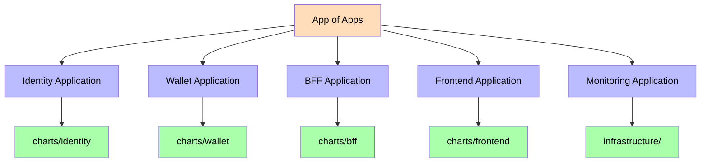
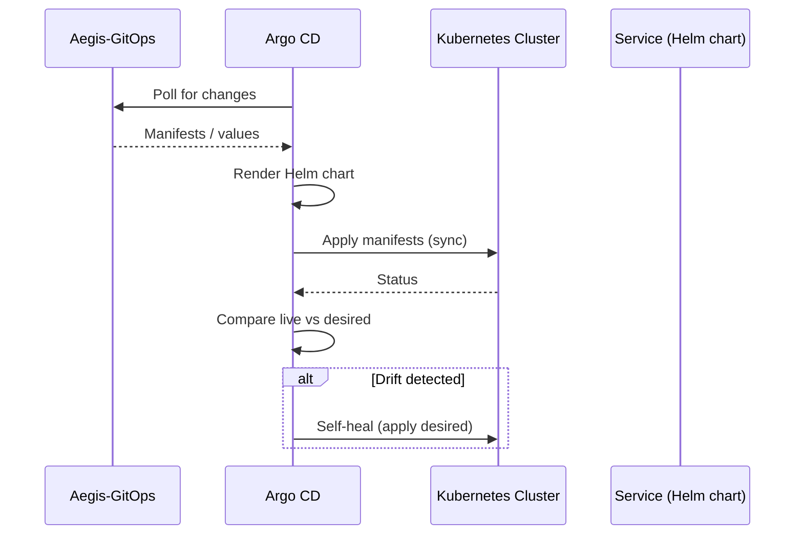
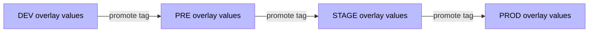

# Argo CD

Argo CD is the GitOps engine of the Aegis platform. It watches the `Aegis-GitOps` repository and continuously syncs the declared manifests into the Kubernetes cluster, keeping each environment in the exact state described in Git.

## App of Apps



## Sync Flow



## Applications

Each service is deployed as an independent Argo CD Application targeting its Helm chart with the environment overlay values:

```yaml
apiVersion: argoproj.io/v1alpha1
kind: Application
metadata:
  name: identity-dev
  namespace: argocd
spec:
  project: default
  source:
    repoURL: https://github.com/AlexAlvarezGallardo-GitHub/Aegis-GitOps
    targetRevision: main
    path: charts/identity
    helm:
      valueFiles:
        - ../../overlays/dev/identity-values.yaml
  destination:
    server: https://kubernetes.default.svc
    namespace: aegis-dev
  syncPolicy:
    automated:
      prune: true
      selfHeal: true
```

## Environment Promotion

Promotion is declarative: to promote a service to a higher environment, the image tag in the corresponding overlay values file is updated in Git. Argo CD picks the change up and syncs automatically.



Related: [[05 - Infrastructure/GitOps\|GitOps]], [[05 - Infrastructure/Helm Charts\|Helm Charts]].
