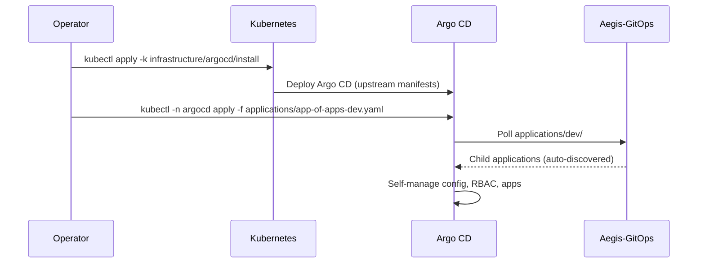
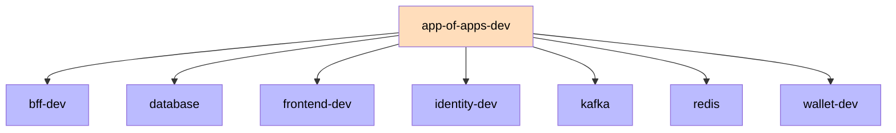
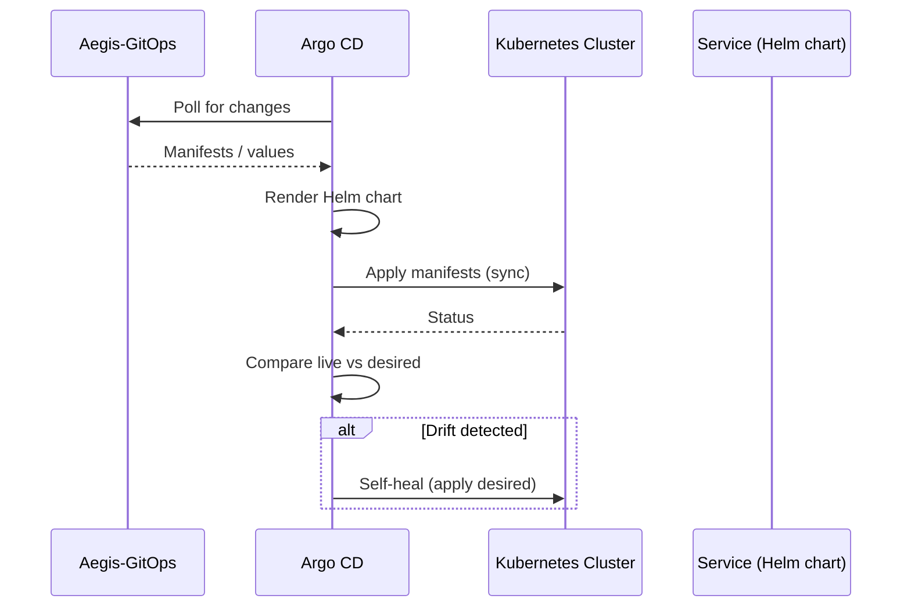

# Argo CD

Argo CD is the GitOps engine of the Aegis platform. It is bootstrapped via GitOps, watches the `Aegis-GitOps` repository, and continuously reconciles the Kubernetes cluster with the declared state. After the one-time bootstrap of `app-of-apps-dev`, no manual `kubectl apply` is used.

## Bootstrap

Argo CD installs itself from the upstream manifests. The `app-of-apps-dev` Application is the single bootstrap point — applied once, then every child Application is auto-discovered from `applications/dev/`. `scripts/setup-minikube.ps1` automates the full bootstrap (cluster creation, Argo CD install via `infrastructure/argocd/install`, GHCR pull secret creation, app-of-apps apply).



## App of Apps (per environment)

The root `app-of-apps-dev` manages every child Application in `applications/dev/` (services + infrastructure). Only DEV has an app-of-apps root today; `pre`, `stage` and `prod` already have individual Applications (`applications/pre|stage|prod/`) that are promotion-ready but not yet wired to their own app-of-apps.



## Sync Flow



## Applications

Each service and infrastructure component is a separate Application, auto-discovered by `app-of-apps-dev`. Service applications point at their Helm chart with the overlay values; infrastructure applications point at a kustomize overlay.

All seven backend services and the frontend are managed by Argo CD in DEV (`identity`, `wallet`, `bff`, `frontend`, `audit`, `fraud`, `reporting`), plus infrastructure (`database`, `kafka`, `redis`) and observability (`monitoring`, `logging`). Promotion to PRE/STAGE/PROD exists today for `identity`, `wallet`, `bff` and `frontend`. Coverage is verified against the canonical [`platform-registry.json`](../../architecture/platform-registry.json) by `docs-drift.yml`.

Service application (`identity`):
```yaml
apiVersion: argoproj.io/v1alpha1
kind: Application
metadata:
  name: identity-dev
  namespace: argocd
spec:
  project: default
  source:
    repoURL: https://github.com/AlexAlvarezGallardo-GitHub/Aegis-GitOps
    targetRevision: main
    path: charts/identity
    helm:
      valueFiles:
        - ../../overlays/dev/identity-values.yaml
  destination:
    server: https://kubernetes.default.svc
    namespace: aegis-dev
  syncPolicy:
    automated:
      prune: true
      selfHeal: true
    syncOptions:
      - CreateNamespace=true
```

Infrastructure application (`database`):
```yaml
apiVersion: argoproj.io/v1alpha1
kind: Application
metadata:
  name: database
  namespace: argocd
spec:
  project: default
  source:
    repoURL: https://github.com/AlexAlvarezGallardo-GitHub/Aegis-GitOps
    targetRevision: main
    path: infrastructure/database/overlays/dev
  destination:
    server: https://kubernetes.default.svc
    namespace: aegis-dev
  syncPolicy:
    automated:
      prune: true
      selfHeal: true
```

Infrastructure components follow the Kustomize `base/` + `overlays/<env>/` pattern: the base is environment-agnostic (no namespace), and each overlay injects its namespace via the `namespace:` field.

## Sync Policies

| Environment | Namespace | Sync | Prune | Self-Heal |
|-------------|-----------|------|-------|-----------|
| DEV   | `aegis-dev`   | Auto | Yes | Yes |
| PRE   | `aegis-pre`   | Auto | Yes | Yes |
| STAGE | `aegis-stage` | Manual/Approval | Yes | Yes |
| PROD  | `aegis-prod`  | Manual/Approval | No  | Yes |

`prune: false` on PROD prevents Argo CD from deleting resources that drift from the declared state — the safest mode for production. STAGE and PROD require a manual sync (approval gate) before promotion.

## Health Checks

Every chart configures liveness and readiness probes (`/actuator/health` for backends, `/` for frontend). Probes use `initialDelaySeconds` (40s liveness / 20s readiness) to accommodate slow Spring Boot startup. Backend services must expose actuator AND permit `/actuator/health/**` without auth in their SecurityConfig. Argo CD uses these probes for application health assessment.

## Dev Monitoring (Health Check Script)

`scripts/check-dev-health.ps1` provides a one-command health check of the DEV environment (minikube). It validates:

1. **Argo CD applications** — all must be `Healthy/Synced`
2. **Pods** in `aegis-dev` — Running, ready, restart count (fails if > 3 restarts)
3. **Resource usage** — `kubectl top pods` (requires the minikube `metrics-server` addon)
4. **Health endpoints** — `/actuator/health` of identity (8081), bff (8082), wallet (8083)

Exit code `0` = healthy, `1` = something failed. Usable locally or in CI.

```powershell
./scripts/check-dev-health.ps1
./scripts/check-dev-health.ps1 -Namespace aegis-dev -SkipHealthEndpoints
```

**History**: this script detected a real incident — a docs-only PR bumped GitOps image tags to a non-existent image SHA, causing all service pods to `ErrImagePull`. The root cause (gitops-update running without image changes) was fixed in CI by gating tag bumps on backend/frontend changes.

Related: [[05 - Infrastructure/GitOps\|GitOps]], [[05 - Infrastructure/Helm Charts\|Helm Charts]].
