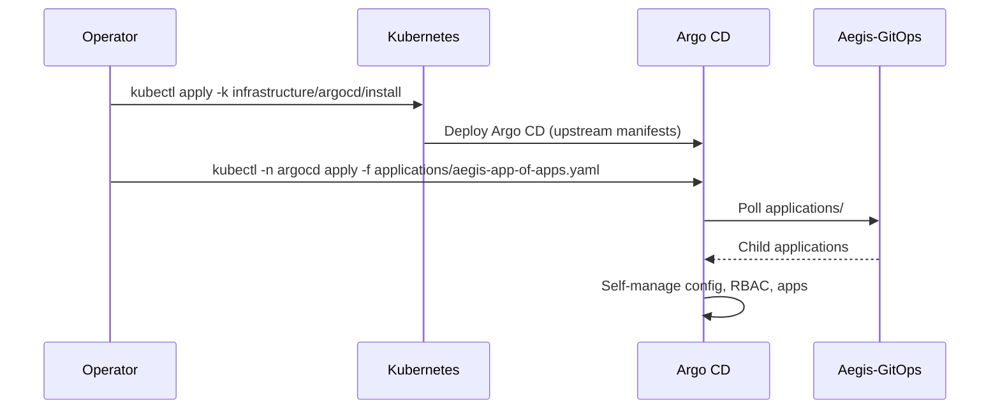
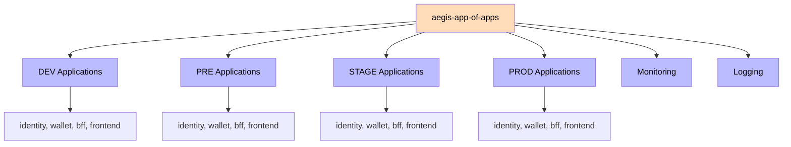
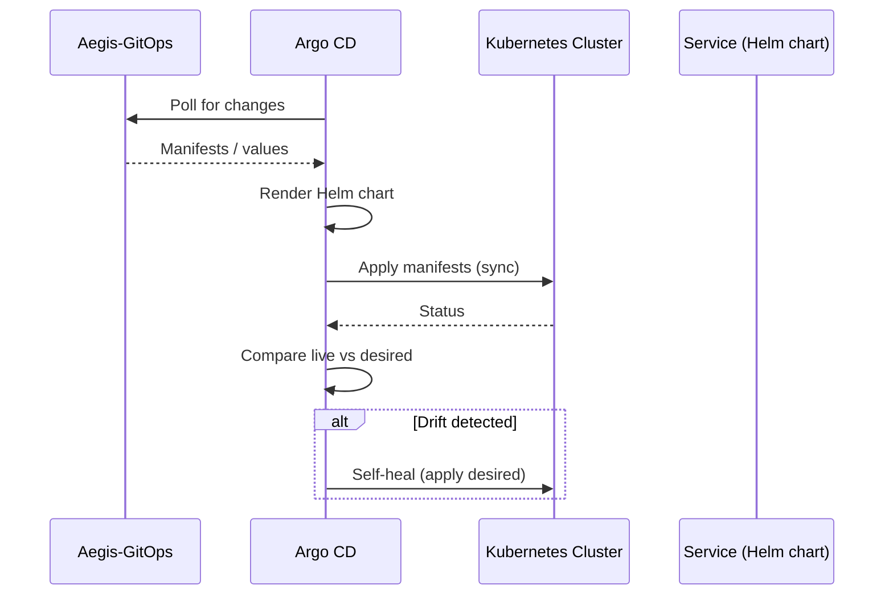
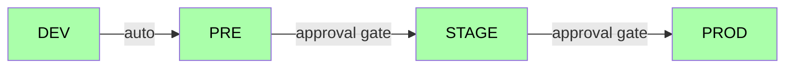

# Argo CD

Argo CD is the GitOps engine of the Aegis platform. It is bootstrapped via GitOps, watches the `Aegis-GitOps` repository, and continuously reconciles the Kubernetes cluster with the declared state. No manual `kubectl apply` is used.

## Bootstrap

Argo CD installs itself from the upstream manifests and then self-manages its own configuration, RBAC and applications.



## App of Apps

The root `aegis-app-of-apps` manages every child application, including itself.



## Sync Flow



## Applications

Each service is deployed per environment. The application points at its Helm chart with the overlay values for that environment:

```yaml
apiVersion: argoproj.io/v1alpha1
kind: Application
metadata:
  name: identity-pre
  namespace: argocd
spec:
  project: default
  source:
    repoURL: https://github.com/AlexAlvarezGallardo-GitHub/Aegis-GitOps
    targetRevision: main
    path: charts/identity
    helm:
      valueFiles:
        - ../../overlays/pre/identity-values.yaml
  destination:
    server: https://kubernetes.default.svc
    namespace: aegis-pre
```

## Sync Policies

| Environment | Sync | Prune | Self-Heal |
|-------------|------|-------|-----------|
| DEV   | Auto  | Yes | Yes |
| PRE   | Auto  | Yes | Yes |
| STAGE | Manual/Approval | Yes | Yes |
| PROD  | Manual/Approval | No  | Yes |

## Environment Promotion

Promotion is declarative: updating the image tag in `overlays/<env>/*-values.yaml` is the promotion. DEV and PRE sync automatically; STAGE and PROD require a manual sync (approval gate).



## Health Checks

Every chart configures liveness and readiness probes (`/actuator/health` for backends, `/` for frontend). Argo CD uses these for application health assessment.

Related: [[05 - Infrastructure/GitOps\|GitOps]], [[05 - Infrastructure/Helm Charts\|Helm Charts]].
