# Database Schema

```mermaid
graph TB
    subgraph "aegis_identity"
        Users["users<br/>id, email, password_hash<br/>status, failed_login_attempts<br/>locked_until, version"]
        Tokens["refresh_tokens<br/>id, token_hash, user_id<br/>expires_at, revoked_at"]
        OutboxI["outbox_events<br/>id, aggregate_id, event_type<br/>payload, topic, status"]
    end
    subgraph "aegis_wallet"
        Wallets["wallets<br/>id, user_id, name<br/>currency, balance<br/>reserved_balance, status, version"]
        Ledger["ledger_entries<br/>id, wallet_id, type<br/>amount, currency<br/>description, reference_id"]
        OutboxW["outbox_events<br/>id, aggregate_id, event_type<br/>payload, topic, status"]
    end
    subgraph "aegis_reporting"
        Projections["balance_projections<br/>id, wallet_id, user_id<br/>balance, currency, last_updated"]
    end
    subgraph "aegis_audit"
        AuditRec["audit_records<br/>id, wallet_id, user_id<br/>amount, currency, source<br/>new_balance, event_timestamp"]
        FraudAudit["fraud_audit_records<br/>id, assessment_id, transaction_id<br/>risk_score, decision<br/>rules_evaluated"]
    end
    subgraph "aegis_fraud"
        FraudRules["fraud_rules<br/>id, name, type<br/>threshold, weight, enabled"]
        Assessments["fraud_assessments<br/>id, transaction_id<br/>risk_score, decision<br/>rules_evaluated, timestamp"]
        OutboxF["outbox_events<br/>id, aggregate_type, event_type<br/>payload, status"]
    end
    Wallets -->|"1:N"| Ledger
    Users --> Tokens
    Users --> OutboxI
    Wallets --> OutboxW
    style Users fill:#afa,stroke:#333,color:#000
    style Tokens fill:#afa,stroke:#333,color:#000
    style Wallets fill:#afa,stroke:#333,color:#000
    style Ledger fill:#fdb,stroke:#333,color:#000
    style OutboxI fill:#bbf,stroke:#333,color:#000
    style OutboxW fill:#bbf,stroke:#333,color:#000
    style Projections fill:#afa,stroke:#333,color:#000
    style AuditRec fill:#afa,stroke:#333,color:#000
    style FraudAudit fill:#afa,stroke:#333,color:#000
    style FraudRules fill:#afa,stroke:#333,color:#000
    style Assessments fill:#afa,stroke:#333,color:#000
    style OutboxF fill:#bbf,stroke:#333,color:#000
```

## Identity Database (`aegis_identity`)

### `users`
| Column | Type | Constraints |
|--------|------|-------------|
| `id` | UUID | PK |
| `email` | VARCHAR(255) | UNIQUE, NOT NULL |
| `password_hash` | VARCHAR(60) | NOT NULL |
| `status` | VARCHAR(30) | NOT NULL |
| `failed_login_attempts` | INT | DEFAULT 0 |
| `locked_until` | TIMESTAMP | NULLABLE |
| `created_at` | TIMESTAMP | NOT NULL |
| `updated_at` | TIMESTAMP | NOT NULL |
| `version` | INT | Optimistic lock |

### `refresh_tokens`
| Column | Type | Constraints |
|--------|------|-------------|
| `id` | UUID | PK |
| `token_hash` | VARCHAR(64) | UNIQUE, NOT NULL |
| `user_id` | UUID | NOT NULL, FK → users.id |
| `expires_at` | TIMESTAMP WITH TIME ZONE | NOT NULL |
| `revoked_at` | TIMESTAMP WITH TIME ZONE | NULLABLE |
| `created_at` | TIMESTAMP WITH TIME ZONE | NOT NULL |

### `outbox_events`
| Column | Type | Constraints |
|--------|------|-------------|
| `id` | UUID | PK |
| `aggregate_id` | UUID | NOT NULL |
| `event_type` | VARCHAR(255) | NOT NULL |
| `payload` | JSONB | NOT NULL |
| `topic` | VARCHAR(255) | NOT NULL |
| `status` | VARCHAR(20) | DEFAULT 'PENDING' |
| `created_at` | TIMESTAMP | NOT NULL |
| `published_at` | TIMESTAMP | NULLABLE |

## Wallet Database (`aegis_wallet`)

### `wallets`
| Column | Type | Constraints |
|--------|------|-------------|
| `id` | UUID | PK |
| `user_id` | UUID | NOT NULL, INDEX |
| `name` | VARCHAR(100) | NULLABLE |
| `currency` | VARCHAR(3) | NOT NULL |
| `balance` | DECIMAL(19,4) | NOT NULL |
| `reserved_balance` | DECIMAL(19,4) | DEFAULT 0 |
| `status` | VARCHAR(20) | NOT NULL |
| `created_at` | TIMESTAMP | NOT NULL |
| `updated_at` | TIMESTAMP | NOT NULL |
| `version` | INT | Optimistic lock |

### `ledger_entries`
| Column | Type | Constraints |
|--------|------|-------------|
| `id` | UUID | PK |
| `wallet_id` | UUID | FK → wallets.id |
| `type` | VARCHAR(20) | NOT NULL |
| `amount` | DECIMAL(19,4) | NOT NULL |
| `currency` | VARCHAR(3) | NOT NULL |
| `description` | TEXT | NULLABLE |
| `reference_id` | VARCHAR(255) | NULLABLE |
| `created_at` | TIMESTAMP | NOT NULL |

### `outbox_events`
Same structure as identity's outbox table, with an extra partial index on `created_at WHERE status = 'PENDING'` for the outbox relay lock.

## Reporting Database (`aegis_reporting`)

### `balance_projections`
| Column | Type | Constraints |
|--------|------|-------------|
| `id` | UUID | PK |
| `wallet_id` | UUID | NOT NULL, UNIQUE |
| `user_id` | UUID | NOT NULL |
| `balance` | DECIMAL(19,2) | NOT NULL |
| `currency` | VARCHAR(3) | NOT NULL |
| `last_updated` | TIMESTAMP | NOT NULL |

## Audit Database (`aegis_audit`)

### `audit_records`
| Column | Type | Constraints |
|--------|------|-------------|
| `id` | UUID | PK |
| `wallet_id` | UUID | NOT NULL, INDEX |
| `user_id` | UUID | NOT NULL, INDEX |
| `amount` | DECIMAL(19,2) | NOT NULL |
| `currency` | VARCHAR(3) | NOT NULL |
| `source` | VARCHAR(50) | NULLABLE |
| `reference` | VARCHAR(255) | NULLABLE |
| `new_balance` | DECIMAL(19,2) | NOT NULL |
| `event_timestamp` | TIMESTAMP | NOT NULL, INDEX |
| `ingested_at` | TIMESTAMP | NOT NULL |
| `correlation_id` | VARCHAR(255) | NULLABLE, INDEX |

### `fraud_audit_records`
| Column | Type | Constraints |
|--------|------|-------------|
| `id` | UUID | PK |
| `assessment_id` | UUID | NOT NULL, INDEX |
| `transaction_id` | UUID | NOT NULL, INDEX |
| `transaction_type` | VARCHAR(30) | NOT NULL |
| `risk_score` | INTEGER | NOT NULL |
| `decision` | VARCHAR(10) | NOT NULL |
| `rules_evaluated` | JSONB | NOT NULL |
| `event_timestamp` | TIMESTAMP | NOT NULL |
| `ingested_at` | TIMESTAMP | NOT NULL |

## Fraud Database (`aegis_fraud`)

### `fraud_rules`
| Column | Type | Constraints |
|--------|------|-------------|
| `id` | UUID | PK |
| `name` | VARCHAR(100) | UNIQUE, NOT NULL |
| `type` | VARCHAR(20) | NOT NULL |
| `threshold` | INTEGER | NOT NULL |
| `weight` | INTEGER | NOT NULL |
| `enabled` | BOOLEAN | DEFAULT TRUE |

### `fraud_assessments`
| Column | Type | Constraints |
|--------|------|-------------|
| `id` | UUID | PK |
| `transaction_id` | UUID | NOT NULL, INDEX |
| `transaction_type` | VARCHAR(30) | NOT NULL |
| `risk_score` | INTEGER | NOT NULL |
| `decision` | VARCHAR(10) | NOT NULL |
| `rules_evaluated` | JSONB | NOT NULL |
| `timestamp` | TIMESTAMP | NOT NULL, INDEX |

### `outbox_events`
| Column | Type | Constraints |
|--------|------|-------------|
| `id` | UUID | PK |
| `aggregate_type` | VARCHAR(100) | NOT NULL |
| `aggregate_id` | UUID | NOT NULL |
| `event_type` | VARCHAR(100) | NOT NULL |
| `payload` | TEXT | NOT NULL |
| `created_at` | TIMESTAMP WITH TIME ZONE | NOT NULL |
| `published_at` | TIMESTAMP WITH TIME ZONE | NULLABLE |
| `status` | VARCHAR(20) | DEFAULT 'PENDING' |
