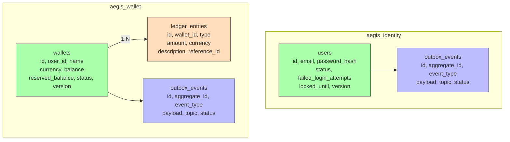

# Database Schema

## Identity Database (`aegis_identity`)

### `users`
| Column | Type | Constraints |
|--------|------|-------------|
| `id` | UUID | PK |
| `email` | VARCHAR(255) | UNIQUE, NOT NULL |
| `password_hash` | VARCHAR(60) | NOT NULL |
| `status` | VARCHAR(30) | NOT NULL |
| `failed_login_attempts` | INT | DEFAULT 0 |
| `locked_until` | TIMESTAMP | NULLABLE |
| `created_at` | TIMESTAMP | NOT NULL |
| `updated_at` | TIMESTAMP | NOT NULL |
| `version` | INT | Optimistic lock |

### `outbox_events`
| Column | Type | Constraints |
|--------|------|-------------|
| `id` | UUID | PK |
| `aggregate_id` | UUID | NOT NULL |
| `event_type` | VARCHAR(255) | NOT NULL |
| `payload` | JSONB | NOT NULL |
| `topic` | VARCHAR(255) | NOT NULL |
| `status` | VARCHAR(20) | DEFAULT 'PENDING' |
| `created_at` | TIMESTAMP | NOT NULL |
| `published_at` | TIMESTAMP | NULLABLE |

## Wallet Database (`aegis_wallet`)

### `wallets`
| Column | Type | Constraints |
|--------|------|-------------|
| `id` | UUID | PK |
| `user_id` | UUID | NOT NULL, INDEX |
| `name` | VARCHAR(100) | NULLABLE |
| `currency` | VARCHAR(3) | NOT NULL |
| `balance` | DECIMAL(19,4) | NOT NULL |
| `reserved_balance` | DECIMAL(19,4) | DEFAULT 0 |
| `status` | VARCHAR(20) | NOT NULL |
| `created_at` | TIMESTAMP | NOT NULL |
| `updated_at` | TIMESTAMP | NOT NULL |
| `version` | INT | Optimistic lock |

### `ledger_entries`
| Column | Type | Constraints |
|--------|------|-------------|
| `id` | UUID | PK |
| `wallet_id` | UUID | FK → wallets.id |
| `type` | VARCHAR(20) | NOT NULL |
| `amount` | DECIMAL(19,4) | NOT NULL |
| `currency` | VARCHAR(3) | NOT NULL |
| `description` | TEXT | NULLABLE |
| `reference_id` | VARCHAR(255) | NULLABLE |
| `created_at` | TIMESTAMP | NOT NULL |

### `outbox_events`
Same structure as identity's outbox table.
