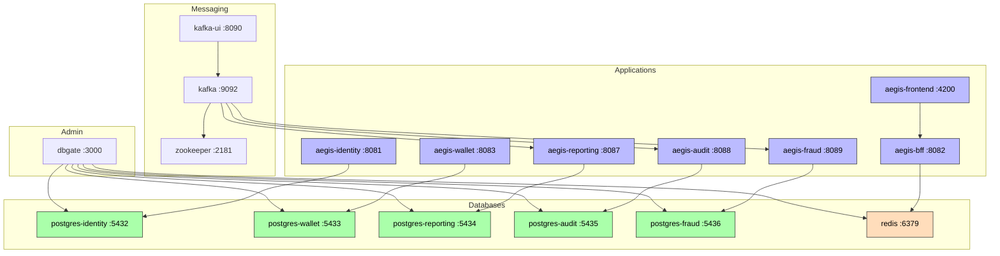

# Docker Services

Local development infrastructure provisioned via Docker Compose.

## Infrastructure Services

| Service | Image | Port | Purpose |
|---------|-------|------|---------|
| `postgres-identity` | postgres:16.4-alpine | 5432 | Identity DB |
| `postgres-wallet` | postgres:16.4-alpine | 5433 | Wallet DB |
| `postgres-reporting` | postgres:16.4-alpine | 5434 | Reporting DB |
| `postgres-audit` | postgres:16.4-alpine | 5435 | Audit DB |
| `postgres-fraud` | postgres:16.4-alpine | 5436 | Fraud DB |
| `zookeeper` | confluentinc/cp-zookeeper:7.5.0 | 2181 | Kafka coordinator |
| `kafka` | confluentinc/cp-kafka:7.5.0 | 9092 | Event broker |
| `kafka-ui` | provectuslabs/kafka-ui:latest | 8090 | Kafka management UI |
| `redis` | redis:7-alpine | 6379 | BFF session store |
| `dbgate` | dbgate/dbgate:6.2.0 | 3000 | DB management UI |

## Application Services

| Service | Dockerfile | Port | Database |
|---------|------------|------|----------|
| `aegis-identity` | `aegis-identity-service/Dockerfile` | 8081 | `aegis_identity` |
| `aegis-wallet` | `aegis-wallet-service/Dockerfile` | 8083 | `aegis_wallet` |
| `aegis-bff` | `aegis-bff-service/Dockerfile` | 8082 | — (Redis) |
| `aegis-reporting` | `aegis-reporting-service/Dockerfile` | 8087 | `aegis_reporting` |
| `aegis-audit` | `aegis-audit-service/Dockerfile` | 8088 | `aegis_audit` |
| `aegis-fraud` | `aegis-fraud-service/Dockerfile` | 8089 | `aegis_fraud` |
| `aegis-frontend` | `frontend/aegis-frontend/Dockerfile` | 4200→80 | — |

## Networks

- `aegis-network` — All services communicate over this internal network

## Volumes

- `postgres_data`
- `postgres_wallet_data`
- `postgres_reporting_data`
- `postgres_audit_data`
- `postgres_fraud_data`

## Configuration Files

- `infra/docker-compose.yml` — Main compose file
- `infra/docker-compose.dev.yml` — Dev overlay (hot-reload volumes)

## Related

- [[01 - Services/Identity Service\|Identity Service]] → connects to `postgres-identity`
- [[01 - Services/Wallet Service\|Wallet Service]] → connects to `postgres-wallet`
- [[01 - Services/BFF Service\|BFF Service]] → connects to `redis`
- [[01 - Services/Reporting Service\|Reporting Service]] → connects to `postgres-reporting`
- [[01 - Services/Audit Service\|Audit Service]] → connects to `postgres-audit`
- [[01 - Services/Fraud Service\|Fraud Service]] → connects to `postgres-fraud`
