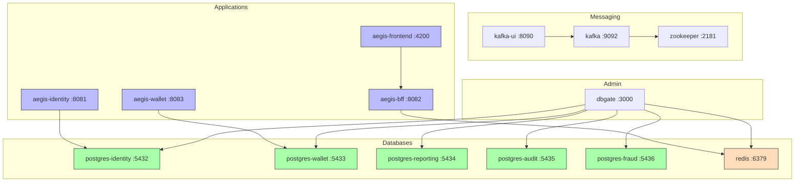

# Docker Services

Local development infrastructure provisioned via Docker Compose.

## Services

| Service | Image | Port | Purpose |
|---------|-------|------|---------|
| `postgres-identity` | postgres:16-alpine | 5432 | Identity DB |
| `postgres-wallet` | postgres:16-alpine | 5433 | Wallet DB |
| `zookeeper` | confluentinc/cp-zookeeper | 2181 | Kafka coordinator |
| `kafka` | confluentinc/cp-kafka | 9092 | Event broker |
| `kafka-ui` | provectuslabs/kafka-ui | 8080 | Kafka management UI |
| `redis` | redis:7-alpine | 6379 | BFF session store |
| `dbgate` | dbgate/dbgate | 3000 | DB management UI |

## Networks

- `aegis-network` — All services communicate over this internal network

## Volumes

- `postgres-identity-data`
- `postgres-wallet-data`
- `kafka-data`
- `zookeeper-data`
- `redis-data`

## Configuration Files

- `infra/docker-compose.yml` — Main compose file
- `infra/docker-compose.dev.yml` — Dev overlay (hot-reload volumes)

## Related

- [[01 - Services/Identity Service\|Identity Service]] → connects to `postgres-identity`
- [[01 - Services/Wallet Service\|Wallet Service]] → connects to `postgres-wallet`
- [[01 - Services/BFF Service\|BFF Service]] → connects to `redis`
