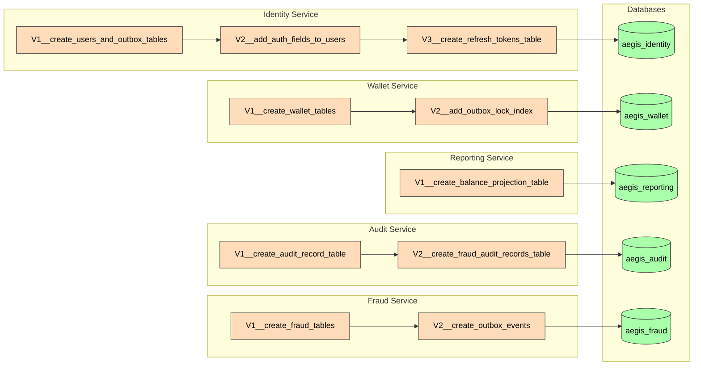

# Flyway Migrations

## Identity Service

| File | Description | Applied |
|------|-------------|---------|
| `V1__create_users_and_outbox_tables.sql` | Initial users + outbox tables | ✅ |
| `V2__add_auth_fields_to_users.sql` | Add failed_login_attempts, locked_until | ✅ |
| `V3__create_refresh_tokens_table.sql` | Refresh token rotation table + indexes | ✅ |

## Wallet Service

| File | Description | Applied |
|------|-------------|---------|
| `V1__create_wallet_tables.sql` | Wallets, ledger_entries, outbox_events | ✅ |
| `V2__add_outbox_lock_index.sql` | Rename status index + partial PENDING index for outbox relay | ✅ |

## Reporting Service

| File | Description | Applied |
|------|-------------|---------|
| `V1__create_balance_projection_table.sql` | Balance projections read model | ✅ |

## Audit Service

| File | Description | Applied |
|------|-------------|---------|
| `V1__create_audit_record_table.sql` | Audit records (deposit events) + indexes | ✅ |
| `V2__create_fraud_audit_records_table.sql` | Fraud audit records + indexes | ✅ |

## Fraud Service

| File | Description | Applied |
|------|-------------|---------|
| `V1__create_fraud_tables.sql` | Fraud rules (seeded defaults) + fraud assessments | ✅ |
| `V2__create_outbox_events.sql` | Outbox events table + index | ✅ |
