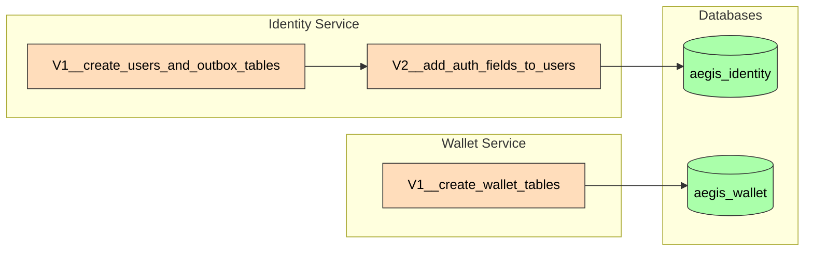

# Flyway Migrations

## Identity Service

| File | Description | Applied |
|------|-------------|---------|
| `V1__create_users_and_outbox_tables.sql` | Initial users + outbox tables | ✅ |
| `V2__add_auth_fields_to_users.sql` | Add failed_login_attempts, locked_until | ✅ |

## Wallet Service

| File | Description | Applied |
|------|-------------|---------|
| `V1__create_wallet_tables.sql` | Wallets, ledger_entries, outbox_events | ✅ |
