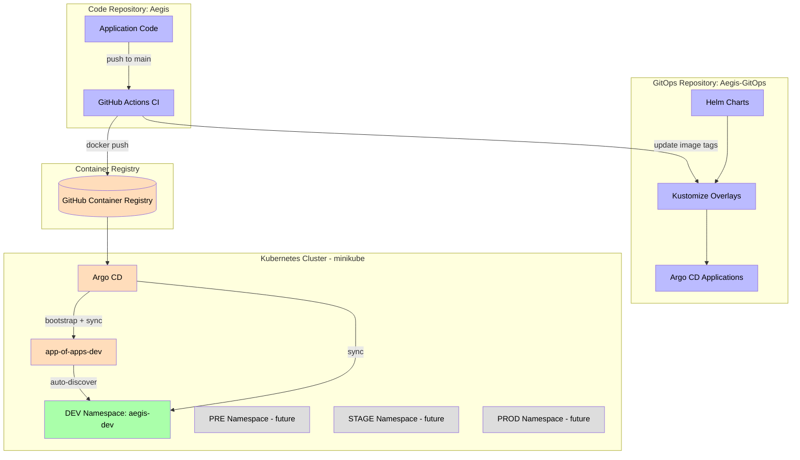
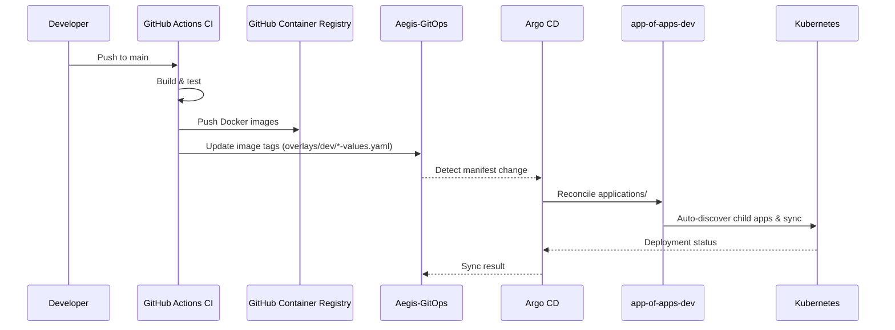
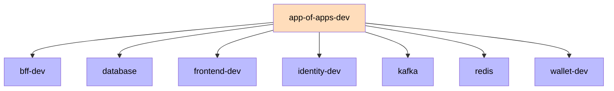

# GitOps

The Aegis platform is deployed through a GitOps workflow: the desired state of every environment is declared in the `Aegis-GitOps` repository, and Argo CD continuously reconciles the Kubernetes cluster with that state. Aegis is a single platform distributed across several repositories, and GitOps separates application code from deployment configuration.

## Repositories

| Repository | Purpose |
|------------|---------|
| `Aegis` | Application code (backend services, frontend, CI/CD workflows) |
| `Aegis-GitOps` | Declarative deployment configuration (Helm charts, overlays, Argo CD applications) |

## Architecture



## Deployment Flow



## Auto-Deployment via App-of-Apps

The root `app-of-apps-dev` Application points at `applications/dev/` (recurse: true). Any new Application manifest added to that directory is **auto-discovered and deployed** by Argo CD — no manual `kubectl apply` is needed. This is the single bootstrap point: it was applied once, and every subsequent Application flows through Git.



## GitOps Repository Structure

```
Aegis-GitOps/
├── applications/          # Argo CD Application manifests
│   ├── app-of-apps-dev.yaml   # Root app-of-apps (auto-discovers dev apps)
│   ├── dev/                   # One application per dev service/infra
│   │   ├── bff.yaml
│   │   ├── database.yaml
│   │   ├── frontend.yaml
│   │   ├── identity.yaml
│   │   ├── kafka.yaml
│   │   ├── redis.yaml
│   │   └── wallet.yaml
│   ├── pre/               # (future app-of-apps per environment)
│   ├── stage/
│   └── prod/
├── base/                  # Shared reference values
├── charts/                # Helm charts per service
│   ├── identity/
│   ├── wallet/
│   ├── bff/
│   └── frontend/
├── overlays/              # Environment-specific Helm values
│   ├── dev/
│   ├── pre/
│   ├── stage/
│   └── prod/
└── infrastructure/        # Platform infrastructure (base/overlays pattern)
    ├── argocd/
    ├── database/          # postgres-identity, postgres-wallet
    ├── kafka/             # kafka, zookeeper
    └── redis/             # redis
```

## Environments

| Environment | Overlay | Namespace | Status |
|-------------|---------|-----------|--------|
| DEV   | `overlays/dev/`   | `aegis-dev`   | **Active** (minikube) |
| PRE   | `overlays/pre/`   | `aegis-pre`   | Not deployed |
| STAGE | `overlays/stage/` | `aegis-stage` | Not deployed |
| PROD  | `overlays/prod/`  | `aegis-prod`  | Not deployed |

Each environment gets its own app-of-apps Application (`app-of-apps-<env>` pointing at `applications/<env>/`) when it becomes active. Overlays and charts for pre/stage/prod already exist in the repo and are promotion-ready.

See [[05 - Infrastructure/Argo CD\|Argo CD]] for application reconciliation and [[05 - Infrastructure/Helm Charts\|Helm Charts]] for chart and overlay details.
