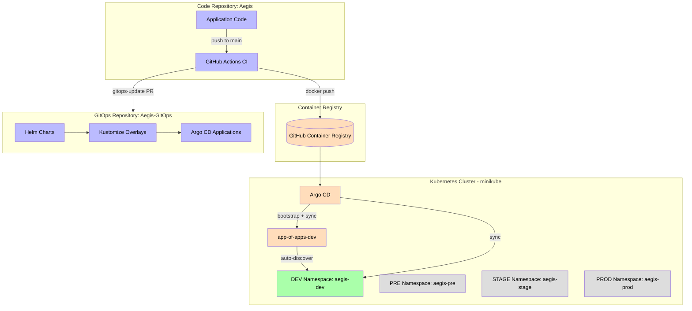
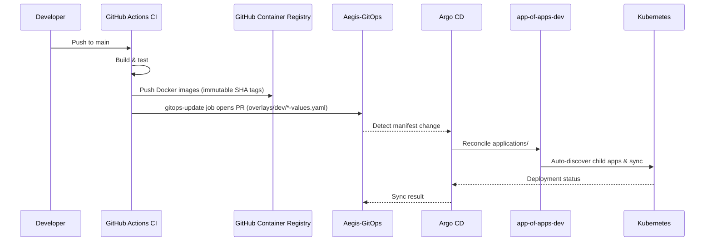
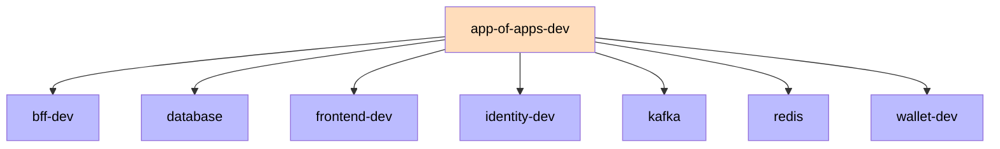

# GitOps

The Aegis platform is deployed through a GitOps workflow: the desired state of every environment is declared in the `Aegis-GitOps` repository, and Argo CD continuously reconciles the Kubernetes cluster with that state. Aegis is a single platform distributed across several repositories, and GitOps separates application code from deployment configuration.

## Repositories

| Repository | Purpose |
|------------|---------|
| `Aegis` | Application code (backend services, frontend, CI/CD workflows) |
| `Aegis-GitOps` | Declarative deployment configuration (Helm charts, overlays, Argo CD applications) |

## Architecture



## Deployment Flow



## Auto-Deployment via App-of-Apps

The root `app-of-apps-dev` Application points at `applications/dev/` (recurse: true). Any new Application manifest added to that directory is **auto-discovered and deployed** by Argo CD — no manual `kubectl apply` is needed. This is the single bootstrap point: it was applied once, and every subsequent Application flows through Git.



## GitOps Repository Structure

```
Aegis-GitOps/
├── applications/          # Argo CD Application manifests
│   ├── app-of-apps-dev.yaml   # Root app-of-apps (auto-discovers dev apps)
│   ├── monitoring.yaml        # Observability stack (ns monitoring)
│   ├── logging.yaml           # Loki + Promtail (ns logging)
│   ├── dev/                   # One application per dev service/infra
│   │   ├── bff.yaml
│   │   ├── database.yaml
│   │   ├── frontend.yaml
│   │   ├── identity.yaml
│   │   ├── kafka.yaml
│   │   ├── redis.yaml
│   │   └── wallet.yaml
│   ├── pre/               # bff, frontend, identity, wallet (no app-of-apps yet)
│   ├── stage/             # bff, frontend, identity, wallet
│   └── prod/              # bff, frontend, identity, wallet
├── base/                  # Shared reference values
├── charts/                # Helm charts per service
│   ├── identity/
│   ├── wallet/
│   ├── bff/
│   └── frontend/
├── overlays/              # Environment-specific Helm values
│   ├── dev/
│   ├── pre/
│   ├── stage/
│   └── prod/
└── infrastructure/        # Platform infrastructure (base/overlays pattern)
    ├── argocd/            # Argo CD install + config + RBAC
    ├── database/          # postgres-identity, postgres-wallet
    ├── kafka/             # kafka, zookeeper
    ├── redis/             # redis
    ├── monitoring/        # Prometheus, Grafana, Tempo, Alertmanager, exporters
    └── logging/           # Loki, Promtail
```

## Environments

| Environment | Overlay | Namespace | Sync | Prune | Self-Heal |
|-------------|---------|-----------|------|-------|-----------|
| DEV   | `overlays/dev/`   | `aegis-dev`   | Auto | Yes | Yes |
| PRE   | `overlays/pre/`   | `aegis-pre`   | Auto | Yes | Yes |
| STAGE | `overlays/stage/` | `aegis-stage` | Manual/Approval | Yes | Yes |
| PROD  | `overlays/prod/`  | `aegis-prod`  | Manual/Approval | **No** | Yes |

The `aegis-pre`, `aegis-stage` and `aegis-prod` applications already exist in `applications/` for the four service charts and are promotion-ready; only DEV has a root `app-of-apps` today (`app-of-apps-dev.yaml`).

## Deployable via GitOps

Argo CD deploys **only** the services that ship a Helm chart:

- `identity`, `wallet`, `bff`, `frontend` (service charts)
- `database`, `kafka`, `redis` (infrastructure)
- `monitoring`, `logging` (observability)

> **Note:** `audit`, `fraud` and `reporting` have **no Helm chart and no Argo CD Application**. They run only via docker-compose locally and ship images to GHCR through CI — they are **not** deployable via GitOps today.

## Images & Pull Secret

- Images are pushed to GHCR under `ghcr.io/alexalvarezgallardo-github/`:
  `identity-service`, `wallet-service`, `bff-service`, `frontend`
- Tags are immutable SHA tags (`tag: <git-sha>`), overridden per environment in `overlays/<env>/*-values.yaml`
- Pods pull images via the `ghcr-pull` imagePullSecret (created by `scripts/setup-minikube.ps1`)

## Bootstrap

- Argo CD installs itself via `infrastructure/argocd/install` (kustomize)
- `applications/app-of-apps-dev.yaml` is the single bootstrap point
- `scripts/setup-minikube.ps1` automates cluster creation, Argo CD install, GHCR pull secret and app-of-apps apply

## Promotion

The `gitops-update` CI job (`ci.yml`) opens a PR against `Aegis-GitOps` updating the dev image tags in `overlays/dev/*-values.yaml`. Promotion to pre/stage/prod follows the same manual-approval flow by bumping the respective overlay values.

See [[05 - Infrastructure/Argo CD\|Argo CD]] for application reconciliation and [[05 - Infrastructure/Helm Charts\|Helm Charts]] for chart and overlay details.
