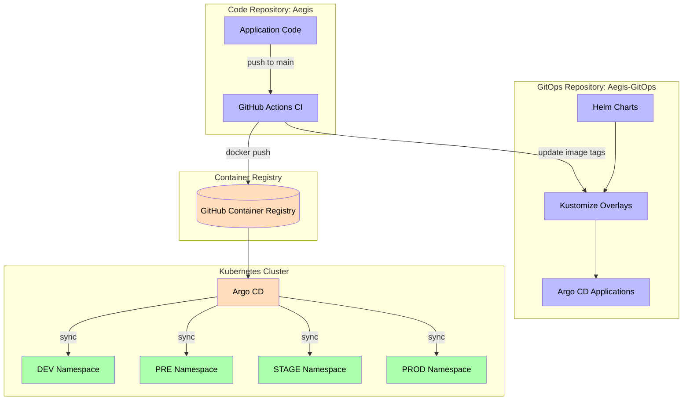
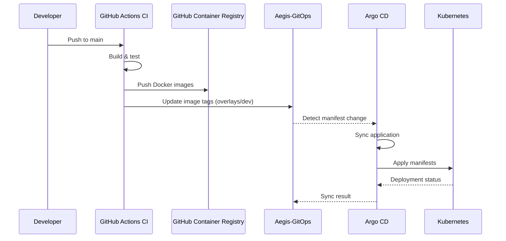

# GitOps

The Aegis platform is deployed through a GitOps workflow: the desired state of every environment is declared in the `Aegis-GitOps` repository, and Argo CD continuously reconciles the Kubernetes cluster with that state. Aegis is a single platform distributed across several repositories, and GitOps separates application code from deployment configuration.

## Repositories

| Repository | Purpose |
|------------|---------|
| `Aegis` | Application code (backend services, frontend, CI/CD workflows) |
| `Aegis-GitOps` | Declarative deployment configuration (Helm charts, overlays, Argo CD applications) |

## Architecture



## Deployment Flow



## GitOps Repository Structure

```
Aegis-GitOps/
├── applications/          # Argo CD Application manifests
│   └── dev/               # One application per service
├── base/                  # Shared reference values
├── charts/                # Helm charts per service
│   ├── identity/
│   ├── wallet/
│   ├── bff/
│   └── frontend/
├── overlays/              # Environment-specific Helm values
│   ├── dev/
│   ├── pre/
│   ├── stage/
│   └── prod/
└── infrastructure/        # Platform infrastructure
    └── argocd/
```

## Environments

| Environment | Overlay | Namespace | Promotes to |
|-------------|---------|-----------|-------------|
| DEV   | `overlays/dev/`   | `aegis-dev`   | PRE |
| PRE   | `overlays/pre/`   | `aegis-pre`   | STAGE |
| STAGE | `overlays/stage/` | `aegis-stage` | PROD |
| PROD  | `overlays/prod/`  | `aegis-prod`  | - |

See [[05 - Infrastructure/Argo CD\|Argo CD]] for application reconciliation and [[05 - Infrastructure/Helm Charts\|Helm Charts]] for chart and overlay details.
