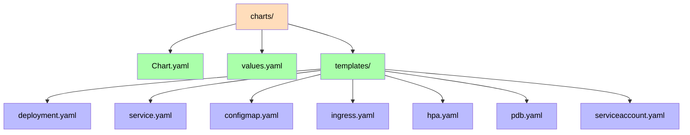
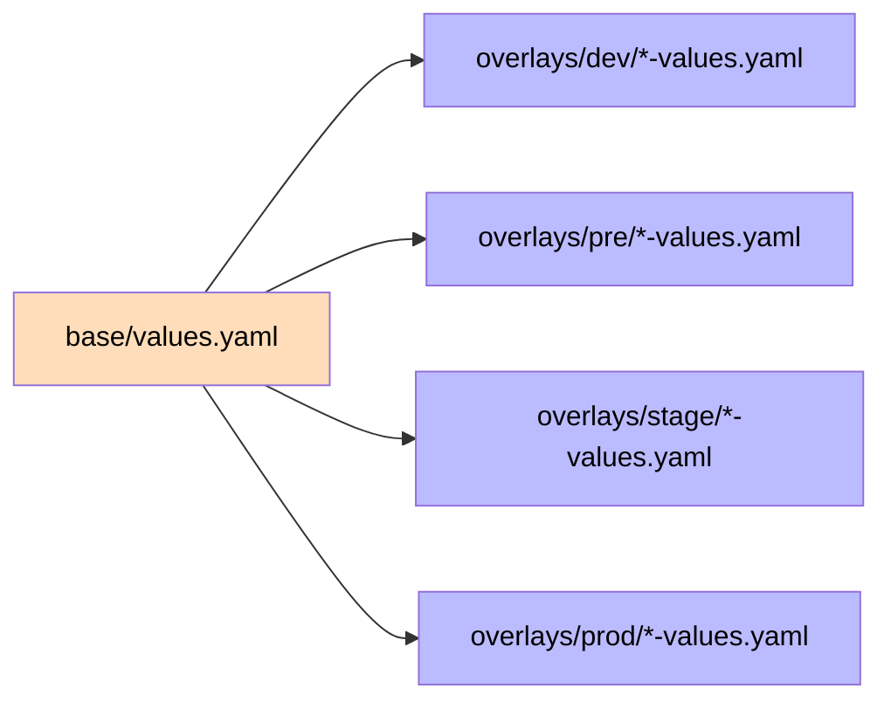

# Helm Charts

Each Aegis service is packaged as a standalone Helm chart under `charts/<service>/` in `Aegis-GitOps`. Environment differences are handled through Kustomize overlays that provide per-environment Helm value files.

## Chart Structure

## Overlay Strategy

Environment-specific configuration is provided via Helm value files in `overlays/<env>/`. Argo CD applications point a chart at `overlays/<env>/<service>-values.yaml`.

## Environment Parameters

Actual per-environment values in `overlays/<env>/*-values.yaml`:

| Parameter | DEV | PRE | STAGE | PROD |
|-----------|-----|-----|-------|------|
| Replicas | 1 | 2 | 2 | 3 (HPA 3-10) |
| CPU request / limit | 250m / 500m | 250m / 500m | 250m / 500m | 500m / 1 |
| Memory request / limit | 384Mi / 768Mi | 256Mi / 512Mi | 256Mi / 512Mi | 512Mi / 1Gi |
| HPA | No | No | No | Yes |
| PDB | No | No | Yes (1) | Yes (2) |
| Affinity | No | No | No | Yes (anti-affinity) |

## Templates

Each chart renders these Kubernetes resources:

- **Deployment**: replicas, image, probes, resources, affinity, tolerations. Replica count is omitted when HPA is enabled.
- **Service**: ClusterIP service on the service port.
- **ConfigMap**: environment variables from `.Values.config`.
- **Ingress**: optional, enabled via `.Values.ingress.enabled`.
- **HorizontalPodAutoscaler**: optional, enabled via `.Values.autoscaling.enabled`.
- **PodDisruptionBudget**: optional, enabled via `.Values.podDisruptionBudget.enabled`.
- **ServiceAccount**: default service account for the pod.

## Probes

Every backend chart configures liveness and readiness probes against `{{ .Values.probe.path }}` (default `/actuator/health`) with delays tuned for slow Spring Boot startup:

| Probe | initialDelaySeconds | periodSeconds | failureThreshold |
|-------|---------------------|---------------|------------------|
| Liveness | 40 | 10 | 8 |
| Readiness | 20 | 10 | 5 |

The probe delays must be present in the chart template — without them, kubelet kills a slow-starting app during its ~40-60s boot (observed on identity, wallet and bff).

## Services

Every backend service plus the frontend ships a Helm chart and is deployable via GitOps. Images are pulled from GHCR (`ghcr.io/alexalvarezgallardo-github/`) using the `ghcr-pull` imagePullSecret with immutable SHA tags:

| Service | Chart | Image | Port | Probe |
|---------|-------|-------|------|-------|
| [[01 - Services/Identity Service\|Identity Service]] | `charts/identity` | `identity-service` | 8081 | `/actuator/health` |
| [[01 - Services/Wallet Service\|Wallet Service]] | `charts/wallet` | `wallet-service` | 8083 | `/actuator/health` |
| [[01 - Services/BFF Service\|BFF Service]] | `charts/bff` | `bff-service` | 8082 | `/actuator/health` |
| [[01 - Services/Audit Service\|Audit Service]] | `charts/audit` | `audit-service` | 8088 | `/actuator/health` |
| [[01 - Services/Fraud Service\|Fraud Service]] | `charts/fraud` | `fraud-service` | 8089 | `/actuator/health` |
| [[01 - Services/Reporting Service\|Reporting Service]] | `charts/reporting` | `reporting-service` | 8087 | `/actuator/health` |
| [[01 - Services/Frontend\|Frontend]] | `charts/frontend` | `frontend` | 80 | `/` |

> Chart and DEV application coverage is verified against the canonical [`platform-registry.json`](../../architecture/platform-registry.json) by `docs-drift.yml`. See [[05 - Infrastructure/Argo CD\|Argo CD]] for which environments each service is promoted to.

## Validation

- `helm lint` passes for all charts (0 failures)
- `helm template` verified for default and production overlays
- `kubectl kustomize` validates all overlays

Related: [[05 - Infrastructure/GitOps\|GitOps]], [[05 - Infrastructure/Argo CD\|Argo CD]].
