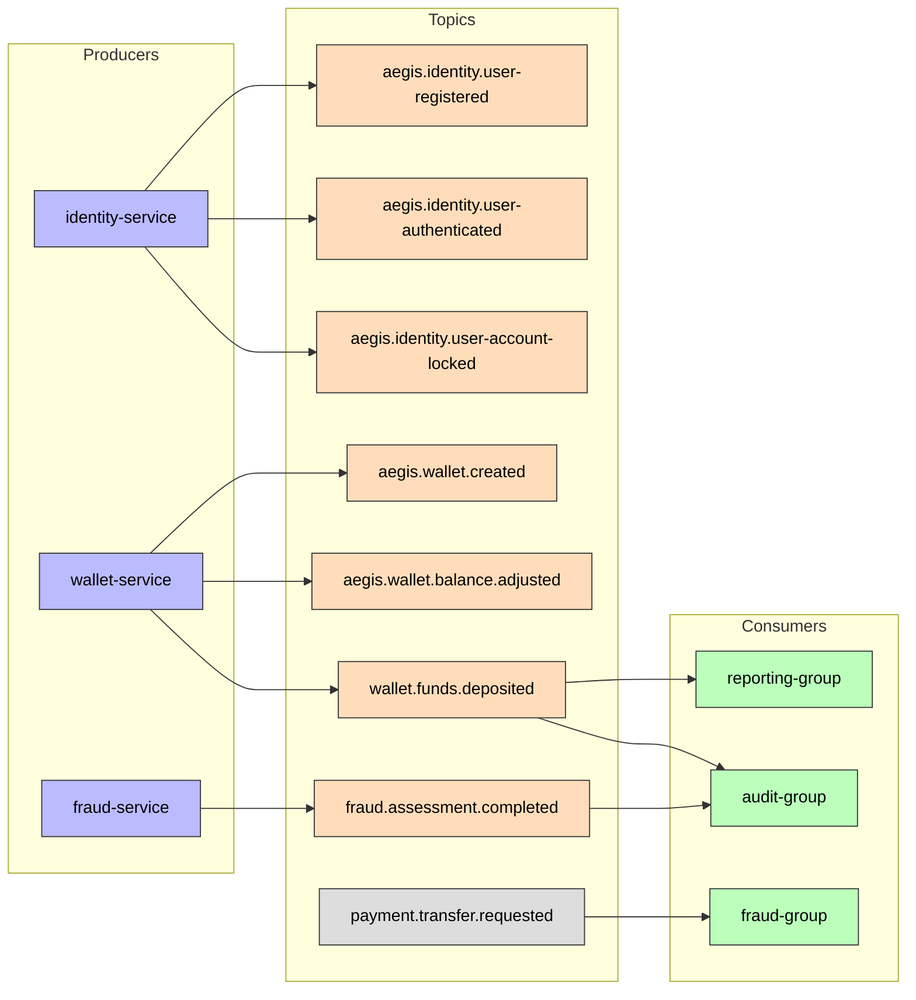
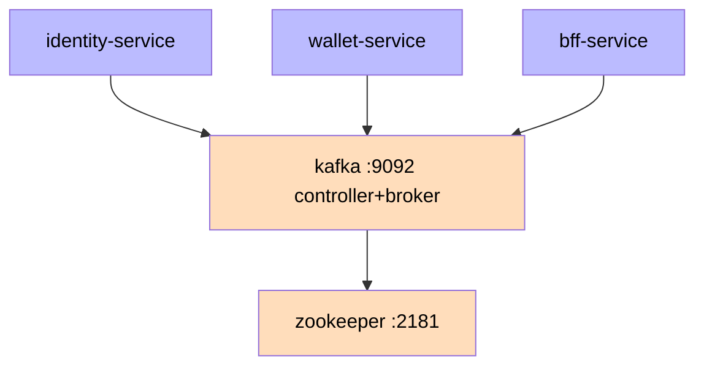

# Kafka Topics

All domain event topics in the Aegis platform.



## Identity Service Topics

| Topic | Event | Partitions | Retention |
|-------|-------|-----------|-----------|
| `aegis.identity.user-registered` | [[03 - Domain Events/UserRegistered\|UserRegistered]] | 3 | 7 days |
| `aegis.identity.user-authenticated` | [[03 - Domain Events/UserAuthenticated\|UserAuthenticated]] | 3 | 7 days |
| `aegis.identity.user-account-locked` | [[03 - Domain Events/UserAccountLocked\|UserAccountLocked]] | 1 | 30 days |

## Wallet Service Topics

| Topic | Event | Partitions | Retention |
|-------|-------|-----------|-----------|
| `aegis.wallet.created` | [[03 - Domain Events/WalletCreated\|WalletCreated]] | 3 | 7 days |
| `aegis.wallet.balance.adjusted` | [[03 - Domain Events/WalletBalanceAdjusted\|WalletBalanceAdjusted]] | 3 | 7 days |
| `wallet.funds.deposited` | [[03 - Domain Events/FundsDeposited\|FundsDeposited]] | 3 | 7 days |

## Fraud Service Topics

| Topic | Event | Partitions | Retention |
|-------|-------|-----------|-----------|
| `fraud.assessment.completed` | [[03 - Domain Events/FraudAssessmentCompleted\|FraudAssessmentCompleted]] | 3 | 30 days |

## Input Topic (consumed by fraud, no producer in backend)

| Topic | Event | Partitions | Notes |
|-------|-------|-----------|-------|
| `payment.transfer.requested` | — | 3 | Entry topic expected from external systems; consumed by fraud ([[01 - Services/Fraud Service\|Fraud Service]]), produced by no backend service today |

## Dead Letter Topics (DLT)

Failed records are retried up to 3 attempts (backoff 1000ms) and then forwarded to a `.dlt` topic via `DeadLetterPublishingRecoverer`:

| DLT Topic | Source | Consumed By |
|-----------|--------|-------------|
| `wallet.funds.deposited.dlt` | `wallet.funds.deposited` | auditing failure path |
| `fraud.assessment.completed.dlt` | `fraud.assessment.completed` | auditing failure path |

DLT suffix and retry are configuration-driven (`aegis.kafka.retry.max-attempts`, `aegis.kafka.retry.backoff-ms`, `aegis.kafka.dlt-suffix`).

## Consumer Groups

| Group | Service | Topics Consumed |
|-------|---------|-----------------|
| `reporting-group` | [[01 - Services/Reporting Service\|Reporting Service]] | `wallet.funds.deposited` |
| `audit-group` | [[01 - Services/Audit Service\|Audit Service]] | `wallet.funds.deposited`, `fraud.assessment.completed` |
| `fraud-group` | [[01 - Services/Fraud Service\|Fraud Service]] | `payment.transfer.requested` |

## Configuration

Topic names are **configuration-driven**, not hardcoded (see ADR-002). Each service defines its topics in `application.yml` under `aegis.kafka.topics`:

- Producers (outbox relay): `KafkaTopicsProperties` resolves event type → topic via `topicFor(eventType)`
- Consumers: `@KafkaListener(topics = "${aegis.kafka.topics.<key>}")`
- Producers: `@Value("${aegis.kafka.topics.<key>}")`

Example (wallet):
```yaml
aegis:
  kafka:
    topics:
      WALLET_CREATED: aegis.wallet.created
      WALLET_BALANCE_ADJUSTED: aegis.wallet.balance.adjusted
      FUNDS_DEPOSITED: wallet.funds.deposited
```

## Naming Convention

```
aegis.<service>.<event-name>
```

## Delivery Semantics

- **Pattern**: Transactional outbox
- **Guarantee**: At-least-once delivery
- **Serialization**: JSON (avro planned for future)

## Infrastructure (GitOps-managed)

Kafka and Zookeeper run in the cluster via Argo CD under the `kafka` Application:

- `infrastructure/kafka/base/` — environment-agnostic manifests
- `infrastructure/kafka/overlays/<env>/` — namespace injection per environment
- Components: `apache/kafka:3.8.0` (combined controller+broker, ports 9092/9093) and `confluentinc/cp-zookeeper:7.5.0` (port 2181)
- Service DNS: `kafka:9092` (used by Spring `bootstrap-servers` in k8s)
- Bootstrap servers: `localhost:9092` locally (dev profile), `kafka:29092` in docker-compose, `kafka:9092` in k8s


