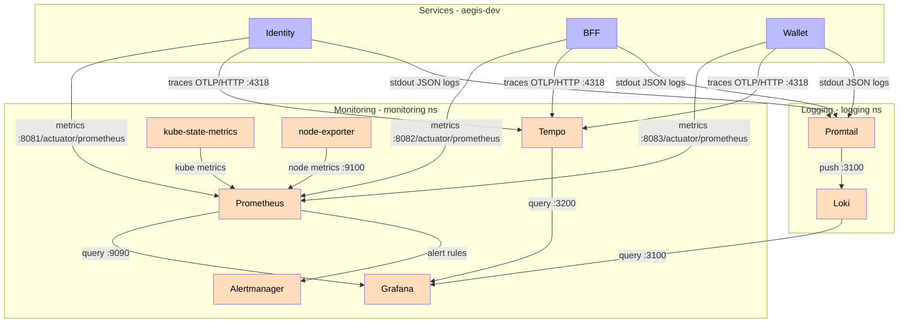
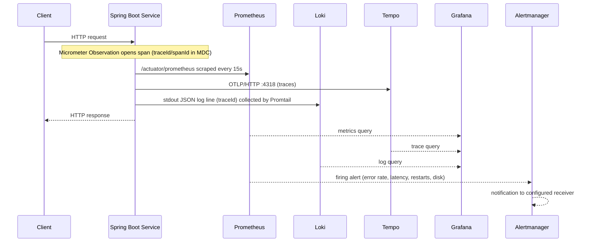

# Observability Stack

The Aegis platform is fully observable through a Grafana LGTM stack managed by Argo CD. Every backend service exports Prometheus metrics (`/actuator/prometheus`), structured JSON logs with correlation IDs (traceId/spanId), and distributed traces via OpenTelemetry (OTLP → Tempo).

## Architecture

## Data Flow

## Components

| Component | Namespace | Image | Role | Access |
|-----------|-----------|-------|------|--------|
| Prometheus | monitoring | `prom/prometheus:v2.53.0` | Metrics collection, alert rules | NodePort `30090` |
| Grafana | monitoring | `grafana/grafana:11.1.0` | Dashboards (JVM, HTTP, Kafka, System) | NodePort `30030` |
| Alertmanager | monitoring | `prom/alertmanager:v0.27.0` | Alert routing/notification | NodePort `30903` |
| Tempo | monitoring | `grafana/tempo:2.5.0` | Trace storage (OTLP gRPC :4317 / HTTP :4318) | ClusterIP |
| kube-state-metrics | monitoring | `registry.k8s.io/kube-state-metrics:v2.13.0` | Cluster state metrics (pod restarts) | ClusterIP |
| node-exporter | monitoring | `prom/node-exporter:v1.8.2` | Host metrics (CPU, memory, disk) | hostNetwork :9100 |
| Loki | logging | `grafana/loki:3.1.1` | Log aggregation | ClusterIP :3100 |
| Promtail | logging | `grafana/promtail:3.1.1` | Log collection (DaemonSet) | DaemonSet |

## Service Instrumentation

Every backend service exports:

- **Metrics** — Spring Boot Actuator + Micrometer + Prometheus registry at `/actuator/prometheus` (JVM, HTTP server, Kafka clients). Prometheus scrapes `/actuator/prometheus`.
- **Logs** — structured JSON via `logstash-logback-encoder` (shared `logback-spring.xml` in `aegis-common`), with `traceId`/`spanId` in MDC for correlation.
- **Traces** — Micrometer Tracing (OpenTelemetry bridge) exporting OTLP **HTTP** to `/v1/traces`. Endpoint overridable via `OTLP_TRACING_ENDPOINT`:
  - Local (dev): `http://localhost:4318/v1/traces`
  - Kubernetes: `http://tempo.monitoring.svc:4318/v1/traces`
  - Sampling is set to **1.0** (`sampling.probability`), and Kafka observation is enabled (W3C `traceparent` propagation, verified by `KafkaTracePropagationIT`).

The `application` label is added via the env var `MANAGEMENT_METRICS_TAGS_APPLICATION` (Spring Boot 3.3 does not resolve `${spring.application.name}` inside `management.metrics.tags.*`), grouping all metrics per service.

## Dashboards

Dashboards are stored as JSON in `infra/observability/dashboards/` and provisioned into Grafana:

| Dashboard | File |
|-----------|------|
| API (HTTP) | `api.json` |
| Database | `database.json` |
| Kafka | `kafka.json` |
| Outbox | `outbox.json` |

## Evidence

Real runtime evidence lives in `evidence/observability/`:

- `load-test-deposits.md` — 40/40 concurrent deposits succeeded; **p95 = 247 ms ≤ SLO 400 ms**
- `grafana-tempo-traces.png`, `grafana-trace-detail.png` — Tempo trace captures
- `trace-http-health.json`, `trace-http-prometheus.json`, `trace-outbox-relay.json` — raw OTLP trace exports
- `evidence-dashboard.png`, `evidence-visual.html` — Grafana dashboard capture

## Search, Indexing & Noise Control

- **Tempo indexing**: traces are ingested into the ingester WAL and cut into searchable parquet blocks every `ingester.max_block_duration` (configured to `5m`). A trace becomes searchable once its block is flushed.
- **Search limit**: Tempo's default search limit (20) can hide traces when blocks contain many objects. Search by `resource.service.name` (always indexed) with a higher limit; span-attribute filters (e.g. `span.http.method`) are only searchable when the attribute is indexed.
- **Noise control**: `spring.task.scheduling.observation-enabled: false` disables the per-poll span of the outbox scheduler (previously ~1 trace/sec even when idle). Log levels are `com.aegis: INFO` and `org.hibernate.SQL: WARN` to avoid SQL DEBUG flooding.

## Correlation IDs

Micrometer Tracing propagates a single trace ID across service boundaries (HTTP and Kafka). The trace ID is injected into the SLF4J MDC (`traceId`/`spanId`) and included in every structured log line, enabling:

- **Logs → Trace**: Grafana Loki logs link to the trace in Tempo via `traceId`.
- **Trace → Logs**: Tempo spans link back to their logs (Tempo datasource `tracesToLogs`).
- Cross-service requests are traceable end to end (BFF → Identity/Wallet, Kafka consumers).

## Data Sources

Grafana datasources: **Prometheus** (default), **Loki**, **Tempo**. Tempo is also reachable directly for trace queries on `:3200`.

## Alert Rules

| Alert | Expression | Severity |
|-------|-----------|----------|
| HighErrorRate | HTTP 5xx ratio > 5% for 5m | Critical |
| HighLatencyP99 | HTTP P99 > 2s for 5m | Warning |
| PodRestarting | `increase(kube_pod_container_status_restarts_total[1h]) > 3` | Warning |
| DiskUsageHigh | filesystem usage > 80% | Warning |

Alertmanager routes to the configured receiver (placeholder webhook in `infrastructure/monitoring/alertmanager/alertmanager-config.yaml`).

## Managed by Argo CD

The stack is declared in the `Aegis-GitOps` repository:

- `infrastructure/monitoring/` — Prometheus, kube-state-metrics, node-exporter, Alertmanager, Grafana, Tempo (Argo CD app `monitoring`).
- `infrastructure/logging/` — Loki + Promtail (Argo CD app `logging`).

No manual `kubectl apply` is required. The `scripts/check-dev-health.ps1` script validates the observability stack (section 5-6) alongside the services.

Related: [[05 - Infrastructure/GitOps\|GitOps]], [[05 - Infrastructure/Argo CD\|Argo CD]].
