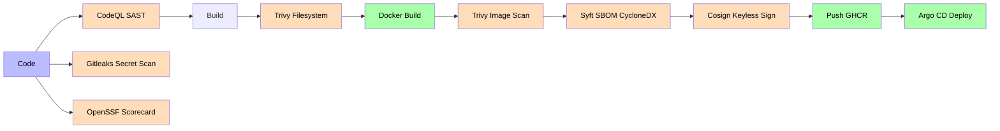
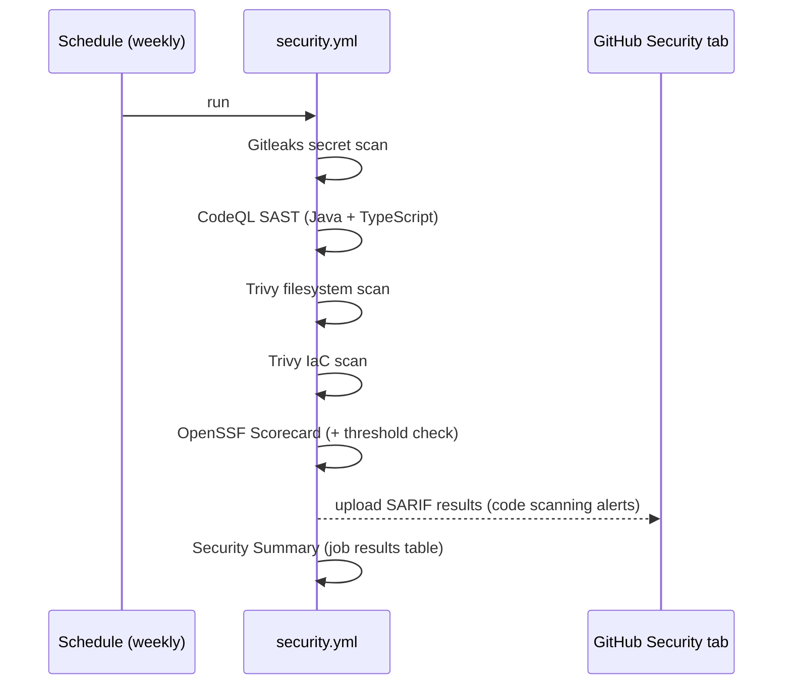

# Security & Supply Chain

The Aegis platform enforces defense-in-depth supply-chain security: static analysis (SAST), secret scanning, container/framework scanning, SBOM generation, artifact signing and dependency management — all automated in CI/CD.

## Supply Chain Flow

## Security Tooling

| Tool | Purpose | Runs in |
|------|---------|---------|
| **CodeQL** | SAST for Java and TypeScript | `security.yml` (weekly + on-demand) |
| **Trivy (image)** | Container image vulnerability scan → SARIF to Security tab | `ci.yml` per image on merge |
| **Trivy (IaC)** | Misconfiguration scan of `infra/` Kustomize/docker-compose | `security.yml` |
| **Trivy (filesystem)** | Dependency + secret scan of the repo | `security.yml` |
| **Gitleaks** | Secret scanning on PRs and scheduled runs (`gitleaks/gitleaks-action`) | `security.yml` |
| **Syft** | SBOM generation (CycloneDX) per Docker image | `ci.yml` (job `sbom`) |
| **Cosign** | Keyless artifact signing via GitHub OIDC | `ci.yml` (job `cosign-sign`) |
| **Dependabot** | Automated dependency updates (Maven, npm, GitHub Actions) | `.github/dependabot.yml` |
| **Renovate** | Advanced dependency management + auto-merge of patch/minor | `renovate.json` |
| **OpenSSF Scorecard** | Supply-chain risk score with minimum threshold (private repo: not published to scorecard.dev) | `security.yml` |

## Security Workflow (scheduled)

## Merge CI (per push)

On every merge to `main`, `ci.yml` builds and pushes images to GHCR, then in parallel:
- **Trivy image scan** → SARIF to Security tab
- **Syft SBOM** (CycloneDX) → uploaded as artifact
- **Cosign sign** (keyless via GitHub OIDC) → signature attached to the GHCR image
- **gitops-update** bumps dev image tags in `Aegis-GitOps`

## Configuration Files

- `.github/workflows/security.yml` — scheduled + on-demand security scans
- `.github/workflows/ci.yml` — Trivy image scan, SBOM, Cosign on merge
- `.github/dependabot.yml` — Dependabot updates
- `renovate.json` — Renovate config with auto-merge policies
- `.gitleaks.toml` — Gitleaks allowlist for dev-only placeholders

Related: [[05 - Infrastructure/GitOps\|GitOps]], [[05 - Infrastructure/Observability Stack\|Observability Stack]].
