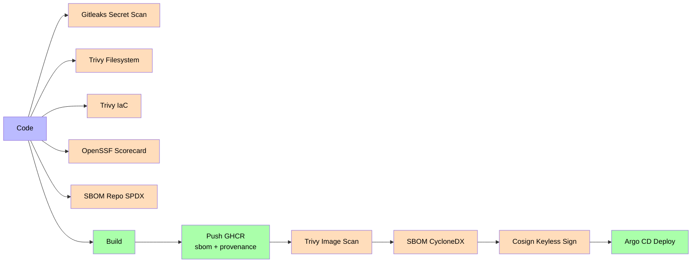
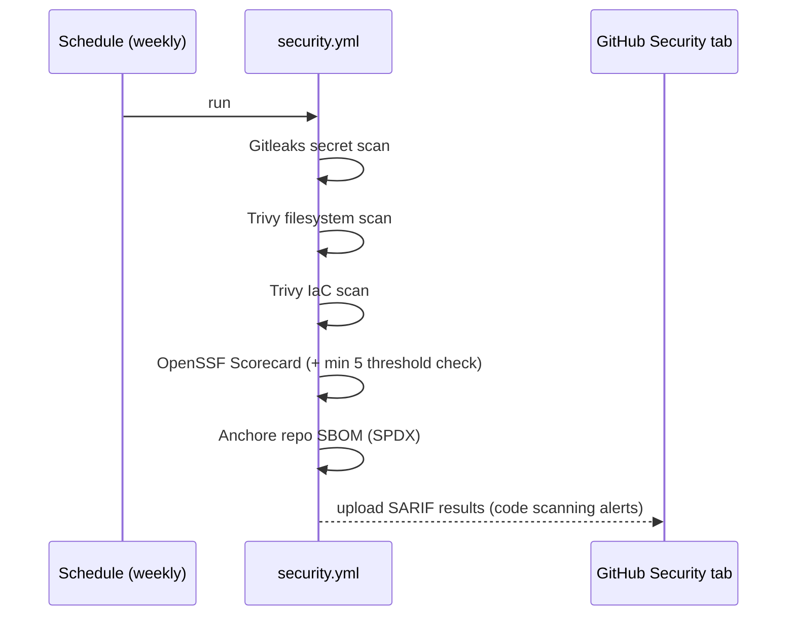

# Security & Supply Chain

The Aegis platform enforces defense-in-depth supply-chain security: static analysis (SAST), secret scanning, container/framework scanning, SBOM generation, artifact signing and dependency management — all automated in CI/CD.

## Supply Chain Flow

## Security Tooling

| Tool | Purpose | Runs in |
|------|---------|---------|
| **CodeQL (SAST)** | Static analysis of Java, TypeScript and GitHub Actions (`Analyze` jobs) | GitHub default setup (on every push/PR) |
| **Gitleaks** | Secret scanning (allowlist for dev-only placeholders in `.gitleaks.toml`) | `security.yml` (weekly + on-demand) |
| **Trivy (filesystem)** | Dependency + secret scan of the repo → SARIF to Security tab | `security.yml` |
| **Trivy (IaC)** | Misconfiguration scan of `infra/` Kustomize/docker-compose → SARIF | `security.yml` |
| **Trivy (image)** | Container image vulnerability scan → SARIF to Security tab | `ci.yml` per image on merge |
| **OpenSSF Scorecard** | Supply-chain risk score, minimum threshold **5** (private repo: not published to scorecard.dev) | `security.yml` |
| **Anchore SBOM (repo)** | Repository SBOM in SPDX format (`aegis-repo-sbom.spdx.json`) | `security.yml` |
| **Syft** | SBOM generation (CycloneDX) per Docker image | `ci.yml` (job `sbom`) |
| **Cosign** | Keyless artifact signing via GitHub OIDC — signs the 7 images | `ci.yml` (job `cosign-sign`) |
| **Dependabot** | Automated dependency updates (Maven, npm, GitHub Actions) | `.github/dependabot.yml` |
| **Renovate** | Advanced dependency management + auto-merge of patch/minor | `renovate.json` |

## Security Workflow (scheduled)

## Merge CI (per push)

On every merge to `main`, `ci.yml` builds and pushes images to GHCR with **`sbom: true`** and **`provenance: true`** build attrs, then in parallel:
- **Trivy image scan** → SARIF to Security tab
- **Syft SBOM** (CycloneDX) → uploaded as artifact
- **Cosign sign** (keyless via GitHub OIDC, 7 images) → signature attached to the GHCR image
- **gitops-update** opens a PR in `Aegis-GitOps` bumping dev image tags in `overlays/dev/*-values.yaml`

## Release Workflow

`release.yml` runs on tags `v*`:
- Builds backend JARs, frontend bundle, and the Docker images tagged with the release tag
- Generates SBOMs and **attaches them to the GitHub Release**

## Other Workflows

| Workflow | Purpose |
|----------|---------|
| `nightly.yml` | Scheduled nightly job |
| `coverage.yml` | Test coverage reporting |
| `update-github-metrics.yml` | GitHub metrics sync |
| `pr-validation.yml` | PR gates + link checker |

## Configuration Files

- `.github/workflows/security.yml` — scheduled + on-demand security scans
- `.github/workflows/ci.yml` — build/push GHCR, Trivy image scan, SBOM, Cosign, gitops-update
- `.github/workflows/release.yml` — release builds + SBOM attachments
- `.github/workflows/nightly.yml`, `coverage.yml`, `update-github-metrics.yml`, `pr-validation.yml`
- `.github/dependabot.yml` — Dependabot updates
- `renovate.json` — Renovate config with auto-merge policies
- `.gitleaks.toml` — Gitleaks allowlist for dev-only placeholders

Related: [[05 - Infrastructure/GitOps\|GitOps]], [[05 - Infrastructure/Observability Stack\|Observability Stack]].
