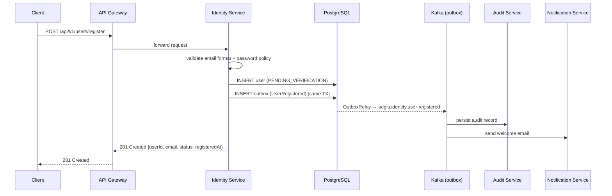

# UC-001 User Registration

**Status**: ✅ Implemented

## Overview

Self-registration for the Aegis platform. Exposes `POST /api/v1/users/register` (unauthenticated), validates email format/uniqueness and password policy, creates the user in `PENDING_VERIFICATION` status, and publishes `UserRegistered` to `aegis.identity.user-registered` via the transactional outbox. Consumers: Audit Service (immutable audit record) and Notification Service (welcome email).

## Key Files

| Type | Location |
|------|----------|
| Spec | `specs/001-user-registration/spec.md` |
| Plan | `specs/001-user-registration/plan.md` |
| Tasks | `specs/001-user-registration/tasks.md` |
| API Contract | `specs/001-user-registration/contracts/registration-api.yaml` |
| Event Schema | `specs/001-user-registration/contracts/user-registered-event.json` |
| Data Model | `specs/001-user-registration/data-model.md` |
| Research | `specs/001-user-registration/research.md` |

## Architecture

- **Service**: [[01 - Services/Identity Service|Identity Service]]
- **Port**: [[04 - Ports/inbound/RegisterUserUseCase|RegisterUserUseCase]]
- **Model**: [[02 - Domain Models/User|User]]
- **Event**: [[03 - Domain Events/UserRegistered|UserRegistered]]

## Business Rules

1. Email MUST be RFC 5322 valid (normalized: trim + lowercase) and globally unique (DB unique constraint → `409 EMAIL_ALREADY_REGISTERED`)
2. Password: 8–128 chars, at least 1 uppercase, 1 lowercase, 1 digit, 1 special char; hashed with BCrypt (strength ≥ 10)
3. New accounts start in `PENDING_VERIFICATION` with a UUID v7 `userId` and UTC `registeredAt`
4. Event published via transactional outbox (same DB transaction as the user insert)

## API

`POST /api/v1/users/register` → `201 Created` `{ userId, email, status, registeredAt }`

Errors: `400` validation (`INVALID_EMAIL_FORMAT`, `PASSWORD_TOO_SHORT`, etc.), `409 EMAIL_ALREADY_REGISTERED`.

## Events

| Event | Topic | Producer | Consumers |
|-------|-------|----------|-----------|
| [[03 - Domain Events/UserRegistered|UserRegistered]] | `aegis.identity.user-registered` | Identity | Audit, Notification |

