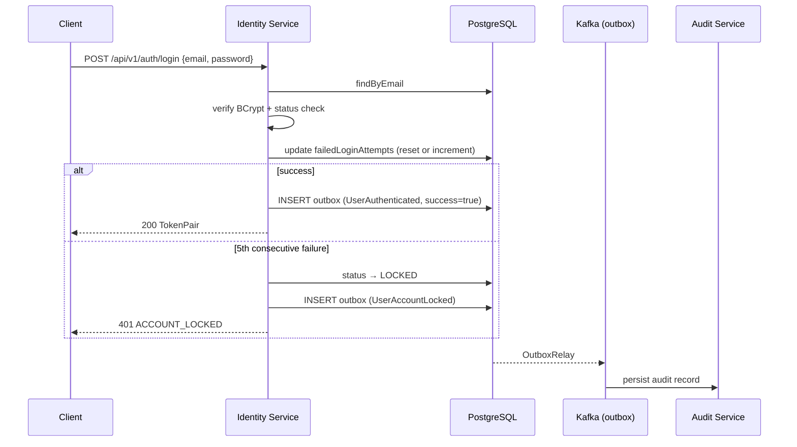

# UC-002 User Authentication

**Status**: ✅ Implemented

## Overview

Email/password login issuing JWT tokens, refresh flow, and account lockout after 5 consecutive failed attempts. Publishes `UserAuthenticated` on every attempt and `UserAccountLocked` when the threshold is exceeded.

## Key Files

| Type | Location |
|------|----------|
| Spec | `specs/002-user-authentication/spec.md` |
| Plan | `specs/002-user-authentication/plan.md` |
| Tasks | `specs/002-user-authentication/tasks.md` |
| API Contract | `specs/002-user-authentication/contracts/auth-api.yaml` |
| Event Schemas | `specs/002-user-authentication/contracts/user-authenticated-event.json`, `specs/002-user-authentication/contracts/user-account-locked-event.json` |
| Data Model | `specs/002-user-authentication/data-model.md` |

## Architecture

- **Service**: [[01 - Services/Identity Service|Identity Service]]
- **Port**: [[04 - Ports/inbound/AuthenticateUserUseCase|AuthenticateUserUseCase]]
- **Models**: [[02 - Domain Models/Credentials|Credentials]], [[02 - Domain Models/TokenPair|TokenPair]]
- **Events**: [[03 - Domain Events/UserAuthenticated|UserAuthenticated]], [[03 - Domain Events/UserAccountLocked|UserAccountLocked]]

## Business Rules

1. Access token: 15 min; refresh token: 7 days (RS256 in prod, HS256 in dev)
2. Account locks after 5 consecutive failures (status → `LOCKED`); counter resets to 0 on success
3. Constant-time password comparison; identical `401 INVALID_CREDENTIALS` for unknown email vs wrong password (no enumeration)
4. Locked → `401 ACCOUNT_LOCKED`; suspended → `401 ACCOUNT_SUSPENDED`
5. Events published via transactional outbox

## API

- `POST /api/v1/auth/login` → `200` `{ accessToken, refreshToken, tokenType, expiresIn, emailVerified }`; errors `401 INVALID_CREDENTIALS` / `ACCOUNT_LOCKED` / `ACCOUNT_SUSPENDED`
- `POST /api/v1/auth/refresh` → `200` new access token; errors `401 INVALID_REFRESH_TOKEN`

## Events

| Event | Topic | Trigger | Consumers |
|-------|-------|---------|-----------|
| [[03 - Domain Events/UserAuthenticated|UserAuthenticated]] | `aegis.identity.user-authenticated` | Every login attempt (success or failure) | Audit |
| [[03 - Domain Events/UserAccountLocked|UserAccountLocked]] | `aegis.identity.user-account-locked` | 5th consecutive failure | Audit, Notification |

