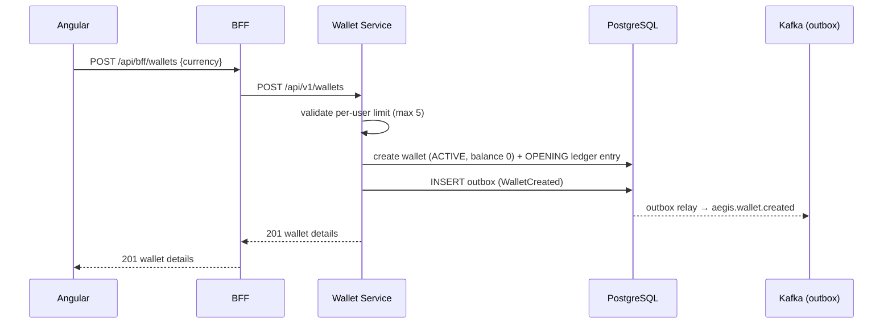

# UC-003 Create Wallet

**Status**: ✅ Implemented

## Overview

Wallet creation for authenticated users in the Wallet Service. Wallets are created with zero balance and `ACTIVE` status, with a configurable per-user limit (default 5). A `WalletCreated` domain event is published to `aegis.wallet.created` via the transactional outbox.

## Key Files

| Type | Location |
|------|----------|
| Spec | `specs/003-create-wallet/spec.md` |
| Plan | `specs/003-create-wallet/plan.md` |
| Tasks | `specs/003-create-wallet/tasks.md` |
| API Contract | `specs/003-create-wallet/contracts/wallet-api.yaml` |
| Event Schema | `specs/003-create-wallet/contracts/events/wallet-created-event.json` |

## Architecture

- **Service**: [[01 - Services/Wallet Service|Wallet Service]]
- **Port**: [[04 - Ports/inbound/CreateWalletUseCase|CreateWalletUseCase]]
- **Models**: [[02 - Domain Models/Wallet|Wallet]], [[02 - Domain Models/WalletId|WalletId]], [[02 - Domain Models/WalletStatus|WalletStatus]]
- **Event**: [[03 - Domain Events/WalletCreated|WalletCreated]]

Subsequent wallet operations are covered by other use cases: [[04 - Ports/inbound/DepositFundsUseCase|DepositFundsUseCase]] (deposits — UC-004) and [[04 - Ports/inbound/UpdateWalletUseCase|UpdateWalletUseCase]] (balance/status changes — UC-009).

## Business Rules

1. Max 5 wallets per user (configurable via `aegis.wallet.max-per-user`, → `409 WALLET_LIMIT_EXCEEDED`)
2. Created with zero balance and `ACTIVE` status
3. Ledger initialized with an `OPENING` entry
4. `WalletCreated` published via transactional outbox

## API

- `POST /api/v1/wallets` `{ currency }` → `201` `{ walletId, userId, balance: 0, currency, status: "ACTIVE", createdAt }`
- `GET /api/v1/wallets` → `200` list of wallets for the authenticated user
- `GET /api/v1/wallets/{id}` → `200` single wallet (owner-only)

## Events

| Event | Topic | Producer | Consumers |
|-------|-------|----------|-----------|
| [[03 - Domain Events/WalletCreated|WalletCreated]] | `aegis.wallet.created` | Wallet | Reporting, Audit |

