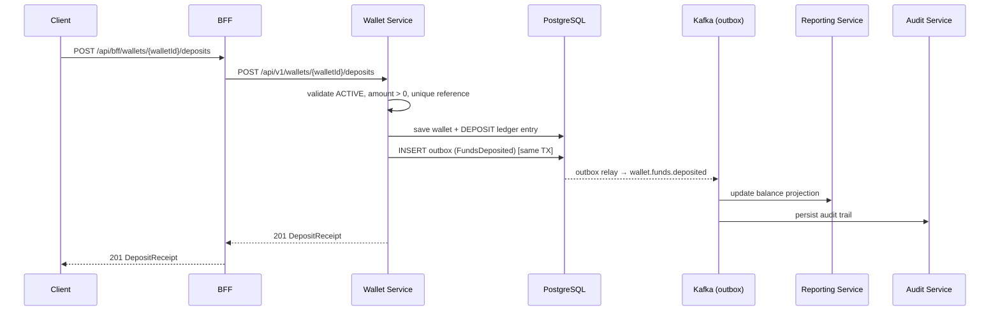

# UC-004 Deposit Funds

**Status**: ✅ Implemented

## Overview

Dedicated deposit endpoint for the Wallet Service with source tracking, idempotency by external reference, and a `FundsDeposited` event for downstream consumers (Reporting balance projections, Audit trail). Deposit reversal is supported as an append-only `REVERSAL` ledger entry that emits no domain event.

## Key Files

| Type | Location |
|------|----------|
| Spec | `specs/004-deposit-funds/spec.md` |
| Plan | `specs/004-deposit-funds/plan.md` |
| Tasks | `specs/004-deposit-funds/tasks.md` |
| API Contract | `specs/004-deposit-funds/contracts/deposit-api.yaml` |
| Event Schema | `specs/004-deposit-funds/contracts/events/funds-deposited.yaml` |

## Architecture

- **Service**: [[01 - Services/Wallet Service|Wallet Service]]
- **Port**: [[04 - Ports/inbound/DepositFundsUseCase|DepositFundsUseCase]]
- **Models**: [[02 - Domain Models/Wallet|Wallet]], [[02 - Domain Models/LedgerEntry|LedgerEntry]], [[02 - Domain Models/LedgerEntryType|LedgerEntryType]]
- **Event**: [[03 - Domain Events/FundsDeposited|FundsDeposited]]

## Business Rules

1. Amount must be positive (> 0)
2. Wallet must be `ACTIVE` (frozen/closed wallets cannot receive deposits)
3. External reference must be unique (idempotency): partial unique index on `DEPOSIT` entries with non-null reference → `409 DUPLICATE_DEPOSIT`
4. Source is required (BANK_TRANSFER, CARD, ...)
5. Reversal appends an immutable `REVERSAL` entry referencing the original deposit (`reversalOf`) — no domain event is emitted

## API

- `POST /api/v1/wallets/{walletId}/deposits` `{ amount, currency, source, reference }` → `201 DepositReceipt` `{ depositId, walletId, newBalance, amount, currency, source, reference, timestamp }`
- `POST /api/v1/wallets/{walletId}/deposits/{depositId}/reversal` `{ reference }` → `200` `{ reversalId, walletId, newBalance, amount, currency, timestamp }` (idempotent by reference; no domain event)

## Events

| Event | Topic | Producer | Consumers |
|-------|-------|----------|-----------|
| [[03 - Domain Events/FundsDeposited|FundsDeposited]] | `wallet.funds.deposited` | Wallet | Reporting, Audit |

