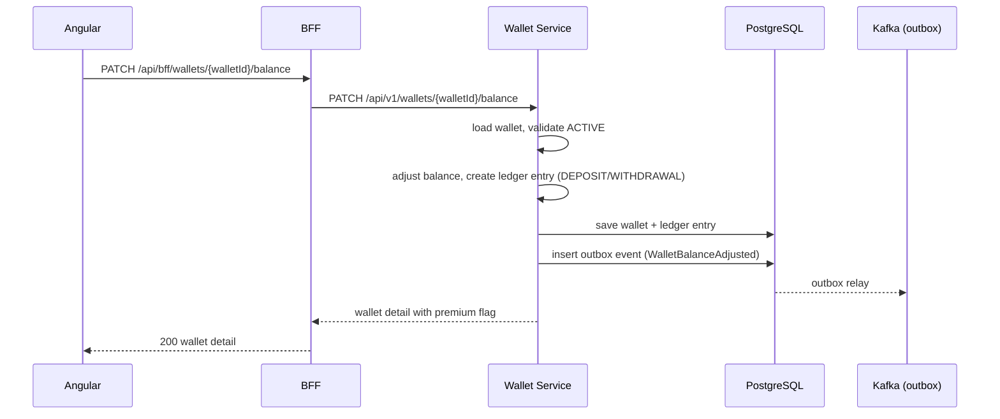
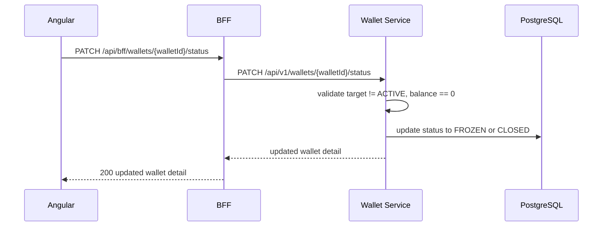

# UC-004 Manage Wallet

**Status**: ✅ Implemented (merged via PR #76)

## Overview

Extend the wallet service with wallet management operations — opening wallet details with enriched metadata (premium flag, balance color indicators), adjusting balances (deposits/withdrawals) with full ledger tracking, and deactivating wallets with business rule enforcement.

### Business Rules
1. **No deactivation with non-zero balance** — Wallet cannot be set to FROZEN or CLOSED if its balance is not zero (returns 409)
2. **Balance color coding** — API returns `premium` boolean and balance sign. UI interprets: positive = green, negative = red
3. **Premium tagging** — If balance > 1000 and currency is EUR, wallet is tagged `premium: true`

## Key Features

- **Open wallet** — Retrieve wallet details with premium flag and balance color indicators
- **Adjust balance** — Deposit (positive amount) or withdraw (negative amount) with ledger tracking
- **Deactivate wallet** — Set status to FROZEN or CLOSED (must have zero balance)

## Key Files

| Type | Location |
|------|----------|
| Spec | `specs/009-manage-wallet/spec.md` |
| Plan | `specs/009-manage-wallet/plan.md` |
| Tasks | `specs/009-manage-wallet/tasks.md` |

## Architecture

- **Service**: [[01 - Services/Wallet Service|Wallet Service]]
- **Ports**: [[04 - Ports/inbound/UpdateWalletUseCase|UpdateWalletUseCase]]
- **Model**: [[02 - Domain Models/Wallet|Wallet]]
- **Events**: WalletBalanceAdjusted (Kafka topic: `aegis.wallet.balance.adjusted`)

### Flow: Adjust Balance

### Flow: Deactivate Wallet

## API Endpoints

| Method | Path | Description |
|--------|------|-------------|
| PATCH | `/api/v1/wallets/{walletId}/balance` | Adjust balance (deposit/withdraw) |
| PATCH | `/api/v1/wallets/{walletId}/status` | Deactivate wallet (FROZEN/CLOSED) |
| GET | `/api/v1/wallets/{walletId}` | Enhanced with `premium` flag |

## Domain Changes

### Wallet -- New Methods
- `adjustBalance(BigDecimal amount, String description)` -- Ledger entry + balance update. Validates wallet is ACTIVE.
- `deactivate(WalletStatus target)` -- Sets FROZEN or CLOSED. Validates balance is zero.
- `isPremium()` -- Returns true if balance > 1000 and currency is EUR.

### New Exceptions
- `WalletOperationNotAllowedException` -- Thrown when deactivation attempted with non-zero balance

## Events

### WalletBalanceAdjusted
- **Topic**: `aegis.wallet.balance.adjusted`
- **Payload**: walletId, userId, previousBalance, newBalance, amount, currency, description, correlationId