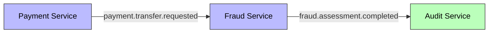
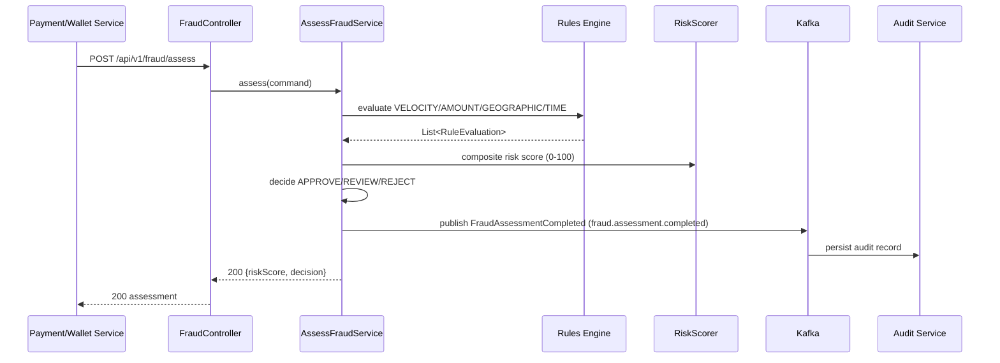

# UC-008 Fraud Detection

**Status**: ✅ Implemented

## Overview

Real-time fraud detection engine (Fraud Service, port 8089) that consumes transactions, evaluates them against configurable rules, calculates a composite risk score (0-100), and issues APPROVE/REVIEW/REJECT decisions.

## Key Files

| Type | Location |
|------|----------|
| Spec | `specs/008-fraud-detection/spec.md` |
| Plan | `specs/008-fraud-detection/plan.md` |
| Tasks | `specs/008-fraud-detection/tasks.md` |
| API Contract | `specs/008-fraud-detection/contracts/api/fraud-api.yaml` |
| Event Schema | `specs/008-fraud-detection/contracts/events/fraud-assessment-completed.yaml` |

## Architecture

- **Service**: [[01 - Services/Fraud Service|Fraud Service]]
- **Port**: [[04 - Ports/inbound/AssessFraudUseCase|AssessFraudUseCase]]
- **Models**: FraudAssessment, FraudDecision, FraudRule, RuleEvaluation
- **Event**: [[03 - Domain Events/FraudAssessmentCompleted|FraudAssessmentCompleted]]

## Business Rules

1. Composite risk score 0-100 (weighted rule aggregation, capped at 100)
2. Score < 30 → **APPROVE**
3. Score 30-70 → **REVIEW**
4. Score > 70 → **REJECT**
5. Rules DB-configurable (no code changes; see ADR-001)
6. Sync assessment must complete in < 200ms

## Rules (defaults, seeded)

| Rule | Type | Threshold | Weight |
|------|------|-----------|--------|
| VELOCITY_CHECK | VELOCITY | 5 | 25 |
| AMOUNT_THRESHOLD | AMOUNT | 1000 | 30 |
| GEOGRAPHIC_ANOMALY | GEOGRAPHIC | 0 | 30 |
| OFF_HOURS_TRANSACTION | TIME | 0 | 15 |

## Events

| Direction | Event | Topic |
|-----------|-------|-------|
| Produced | [[03 - Domain Events/FraudAssessmentCompleted|FraudAssessmentCompleted]] | `fraud.assessment.completed` |
| Consumed | TransferRequested | `payment.transfer.requested` |

## API

- `POST /api/v1/fraud/assess` — sync assessment `{ transactionId, transactionType, amount, currency, sourceWalletId, destWalletId, userId }` → `200` `{ assessmentId, transactionId, riskScore, decision, rulesEvaluated, timestamp }`
- `GET /api/v1/fraud/assessments/{id}` — retrieve stored assessment

