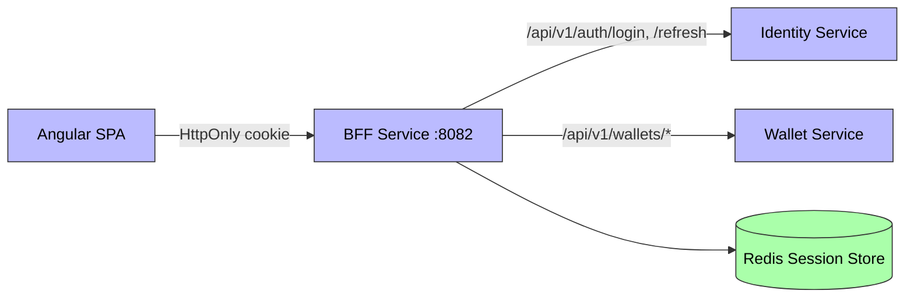

# UC-010 BFF (Backend-for-Frontend)

**Status**: ✅ Implemented

## Overview

Single entry point for the Angular SPA. Proxies auth and wallet requests, stores JWTs in an **HttpOnly session cookie** backed by Redis (inaccessible to JS), and handles transparent token refresh. Includes a development-only mock login endpoint.

## Key Files

| Type | Location |
|------|----------|
| Spec | `specs/010-bff/spec.md` |
| Plan | `specs/010-bff/plan.md` |
| Tasks | `specs/010-bff/tasks.md` |
| API Contract | `specs/010-bff/contracts/bff-api.yaml` |

## Architecture

- **Service**: [[01 - Services/BFF Service|BFF Service]]
- **Depends on**: [[01 - Services/Identity Service|Identity Service]], [[01 - Services/Wallet Service|Wallet Service]], Redis (session store)
- **Depended by**: [[01 - Services/Frontend|Frontend]]

## Key Design Decisions

| Decision | Choice |
|----------|--------|
| Session store | Redis (distributed) |
| Cookie | HttpOnly, Secure, SameSite=Strict |
| HTTP client | WebClient (proxying) |
| Token exposure | Angular never sees raw JWTs |

## API Endpoints

| Method | Path | Description |
|--------|------|-------------|
| POST | `/api/bff/auth/login` | Proxy to Identity login; stores tokens in HttpOnly session cookie |
| POST | `/api/bff/auth/logout` | Invalidates session, clears cookie |
| GET | `/api/bff/auth/me` | Current user from session JWT |
| POST | `/api/bff/auth/refresh` | Transparent access-token refresh |
| POST | `/api/bff/auth/mock-login` | Development-only mock session (`mock@aegis.dev`) |
| GET/POST/PATCH | `/api/bff/wallets/*` | Proxy to Wallet Service |

