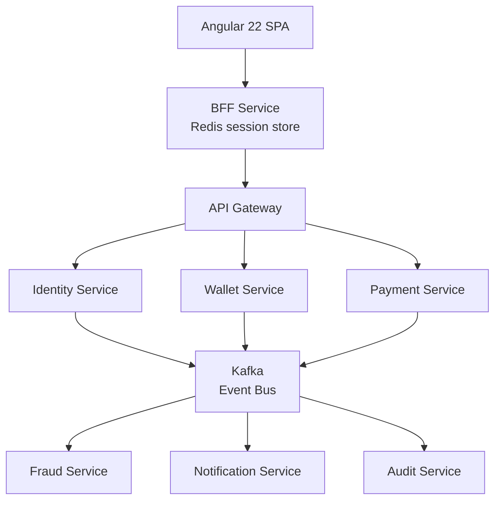
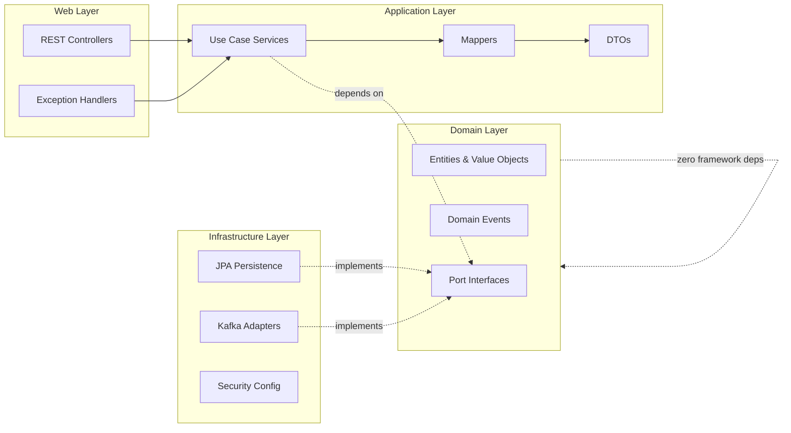

# Feature Specification: UC-011 Engineering Portfolio Website

**Feature Branch**: `feature/011-engineering-portfolio`

**Created**: 2026-08-05

**Status**: Draft

---

> **Mission:** Build a portfolio website that presents a cohesive engineering case study in the visual language of an enterprise SaaS product.

> **Tracked by issue**: #144 (Engineering Portfolio Website)

---

## Problem

Aegis demonstrates engineering excellence through code, specs, ADRs and GitOps — but there is no public surface that *sells* that engineering to the people who decide interviews: Engineering Managers, Staff Engineers, Architects, CTOs and Technical Recruiters.

## Solution

Build a static engineering portfolio website that presents the engineering case study in the visual language of an enterprise SaaS product site. It is **not** meant to sell Aegis the product; it is meant to sell the engineering behind it. Every page answers a question a technical interviewer would naturally ask, and every claim must be **traceable to the real repository** (specs, contracts, ADRs, obsidian vault, CI/CD, coverage).

A recruiter who finishes exploring must conclude:

> **"This engineer knows how to design, build and operate production-oriented software. I want to interview them."**

---

## Core Principles

Every section reinforces at least one:

| Principle | Demonstration |
|------------|---------------|
| Architecture | Clean hexagonal architecture, DDD, diagrams, ADRs |
| Engineering Excellence | Testing, CI/CD, automation |
| Scalability | Distributed systems, messaging, caching |
| Production Readiness | Monitoring, security, observability |
| Product Thinking | UX, branding, documentation |
| Innovation | AI-assisted engineering workflow with human ownership |

---

## User Journey

The website tells a story. Every section answers one important question.

```
Landing
  → What is Aegis?
  → Why was it built?
  → How does it work?
  → How is it architected?
  → How is it deployed?
  → How is it monitored?
  → How is AI integrated?
  → How does it evolve?
  → Who built it?
```

## Website Structure

```
Home
Platform
Architecture
Engineering
AI Platform
Infrastructure
Security
Documentation
Roadmap
About
```

---

## Section 1 — Hero

### Objective

Capture attention immediately. The visitor should feel they are looking at the homepage of a polished, credible technology company.

### Content

- Aegis Logo
- AI Native Financial Platform
- Short value proposition
- Primary CTA
- GitHub CTA
- Animated platform visualization

### Message

> Financial platform reference architecture built with modern cloud architecture, distributed systems and an AI-assisted engineering workflow.

---

## Section 2 — Platform

### Objective

Explain the product before explaining the technology.

### Questions answered

- What is Aegis?
- What problems does it solve?
- Who is it for?

### Content

- Platform Overview
- Wallet Management
- Payments
- Fraud Detection
- Notifications
- Audit
- Reporting

Avoid technical jargon. Focus on business value.

---

## Section 3 — Architecture

> **NOTE (discrepancy resolved):** This section MUST describe the **real Aegis stack**. The original draft described a fictional .NET 10 / Aspire / RabbitMQ / MassTransit / GraphQL / gRPC platform that contradicts the repository. Since recruiters WILL open the repo, the site must be truthful. Verified against `README.md`, `docs/PLATFORM_VISION.md` and the obsidian vault.

### Objective

Demonstrate software architecture knowledge using the actual platform.

### Components

- High-level architecture diagram (Angular → BFF → API Gateway → services → Kafka)
- Service interactions
- Event-driven communication (Kafka, transactional outbox)
- API Gateway / BFF
- Identity
- Wallet
- Payment
- Fraud
- Notification
- Audit
- Reporting

### Real Platform Technologies

- **Java 21** — language
- **Spring Boot 3** — backend framework
- **Spring Data JPA + PostgreSQL 16** — persistence (Flyway migrations)
- **Apache Kafka** — event backbone (`aegis.<service>.<event>` topics, transactional outbox, at-least-once delivery)
- **Redis 7** — distributed session store for the BFF
- **Angular 22 + Angular Material** — SPA frontend
- **REST + OpenAPI 3 (spec-first)** — API contracts
- **Docker (multi-stage, distroless)** — containerization
- **Kubernetes + Helm** — orchestration
- **Argo CD (GitOps)** — continuous deployment
- **GitHub Actions + GHCR** — CI/CD and container registry

### Architecture Diagrams



### Hexagonal Architecture (Ports & Adapters)



### Transactional Outbox

Guaranteed at-least-once event delivery without distributed transactions: aggregate operation + domain event persist in a single ACID transaction, event written to `outbox_events`, `OutboxRelayScheduler` forwards to Kafka, status updates to `PUBLISHED` on ack.

---

## Section 4 — Engineering

### Objective

Explain engineering decisions. Not technologies. **Decisions.** Every major technology must answer *Why?*

---

## Why Microservices?

Business isolation, independent deployment, scalability. Each bounded context owns its data — no shared databases.

## Why Kafka?

Asynchronous, event-driven communication. High throughput, persistent, replayable events. Paired with the **transactional outbox** for exactly-once-persisted, at-least-once-delivered guarantees without distributed transactions.

## Why Hexagonal Architecture (Ports & Adapters)?

Domain layer is pure Java — zero framework dependencies. Business logic is testable, framework-agnostic, and swaps infrastructure (JPA, Kafka) without touching domain rules. Enforced by Checkstyle in CI.

## Why PostgreSQL?

Consistency, ACID transactions, relational integrity — non-negotiable for financial data.

## Why Spring Boot?

Industry standard, mature ecosystem, massive production adoption. Maven multi-module + Checkstyle for reproducible, quality-gated builds.

## Why Kubernetes + Argo CD (GitOps)?

Infrastructure as Code, immutable deployments, self-healing, environment isolation (dev/pre/stage/prod overlays). Argo CD owns deployment — GitHub Actions only builds and updates the GitOps repo. No manual deployments.

## Why OpenTelemetry?

Distributed tracing, production diagnostics, performance analysis. Every service is instrumented and exports metrics, logs and traces.

---

## Section 5 — Infrastructure

### Objective

Show production readiness.

### Topics

- CI/CD — GitHub Actions (matrix builds, parallel validations, quality gates)
- Docker — multi-stage, distroless images (minimal attack surface)
- Container Registry — GHCR with immutable image tags
- Infrastructure — Kubernetes + Helm charts per service (`base/` + overlays)
- Deployment Strategy — GitOps via Argo CD (no direct deploys)
- Secrets Management — Kubernetes secrets + GitOps, gitleaks pre-commit
- Health Checks — Spring Actuator endpoints, verified on deploy
- Automatic Releases — automated release workflow
- Monitoring — Prometheus, Grafana, Loki, Tempo

---

## Section 6 — Observability

### Objective

Demonstrate operational maturity.

### Components

- Metrics — Prometheus
- Distributed Tracing — OpenTelemetry + **Tempo** (not Jaeger — Tempo is the stack in use)
- Structured Logging — Loki
- Dashboards — Grafana
- Alerts — Grafana/Prometheus alerting
- Health Checks — Actuator
- Performance Monitoring

---

## Section 7 — Security

### Objective

Demonstrate a production mindset.

### Topics

- JWT + session-based auth via **BFF** (HttpOnly cookies, CSRF protection)
- RBAC
- Secrets Management — Kubernetes secrets, gitleaks, .gitleaks.toml
- Encryption — BCrypt (≥10) password hashing
- Rate Limiting (future — API Gateway)
- Audit Logs — immutable audit service
- OWASP — security headers
- Supply chain — Trivy, CodeQL, Cosign signing, Dependabot/Renovate, SBOM (Syft)

---

## Section 8 — AI Platform

### Objective

Show that AI is part of the engineering workflow — not an external API call. Aegis's AI is the **AI-assisted development workflow** (specialized AI agents: spec, architect, service-builder, test-engineer, infra-engineer, reviewers) directed by a human who retains ownership of architecture, validation and technical decisions. This is real and documented in the README.

### Components

- Agent Orchestration — specialized agents, one per discipline
- Spec-Driven Pipeline — spec → architecture → plan → build → test → review
- Quality Gates — architectural compliance is automatic
- Model Selection / Tooling — opencode, per-convention agents
- (Optional future content) Prompt management, RAG, model routing — only if honestly applicable

---

## Section 9 — Engineering Dashboard

### Objective

Provide live evidence of engineering practices. The dashboard must consume **real repository metrics** — never sample or fabricated data.

### Data source (decided)

- A GitHub Actions workflow (`.github/workflows/update-github-metrics.yml`) fetches real values from the GitHub REST API on a schedule and commits them to `portfolio/public/data/github-metrics.json`.
- The portfolio site reads this file at **build time** — no runtime GitHub calls, no sample fallback.
- If the workflow has never run or the file is missing, the dashboard shows **"Metrics temporarily unavailable"**. It must never substitute static values.

### Schema (`github-metrics.json`)

```json
{
  "repository": "Aegis",
  "lastCommit": "ISO 8601 timestamp",
  "commitCount": 106,
  "openPullRequests": 27,
  "closedPullRequests": 54,
  "latestRelease": "v0.1.0 | null",
  "ciStatus": "success | failure | no runs yet",
  "lastCiRun": "ISO 8601 timestamp",
  "generatedAt": "ISO 8601 timestamp"
}
```

### Widgets

- Last commit
- Number of commits
- Open and closed pull requests
- Latest release
- Last CI run + status
- Generated-at timestamp (proves freshness)

> The remaining widgets in the original draft (Issues, Latest Deployments, Code Coverage, Documentation Coverage, Roadmap Progress, Version) are either covered elsewhere on the site or are **planned** — they must not be shown with sample numbers until a real source exists.

---

## Section 10 — Documentation

### Objective

Show engineering discipline.

### Pages

- Architecture
- ADR (Architecture Decision Records) — `docs/adr/` (ADR-001..003, more)
- API Documentation — OpenAPI contracts in `specs/*/contracts/`
- Coding Standards — `AGENTS.md`, constitution, Checkstyle
- Development Setup — `docs/AGENTS-README.md`, README "Getting Started"
- Deployment Guide — GitOps / Argo CD
- Contributing Guide
- Changelog

---

## Section 11 — Roadmap

### Objective

Demonstrate continuous evolution.

### Categories

- Completed
- In Progress
- Planned
- Future Vision (`docs/PLATFORM_VISION.md`, HANDOVER plan)
- Timeline
- Upcoming Features

---

## Section 12 — About

The final section. The project remains the protagonist.

### Content

- Engineering Philosophy
- Professional Background
- Technology Stack
- Resume
- GitHub
- LinkedIn
- Contact

Suggested message:

> Aegis is my engineering laboratory where I design, build and operate cloud-native, AI-assisted platforms using the same principles expected in production software.

---

# Design Language

## Style

Minimalistic, modern, enterprise, premium, technical, confident.

## Inspiration

Stripe, Vercel, Linear, Supabase, OpenAI, Raycast.

## Colors

| Token | Value |
|-------|-------|
| Background | `#09090B` |
| Surface | `#111113` |
| Cards | `#18181B` |
| Primary | `#D4AF37` |
| Accent | `#E6C15A` |
| Text | `#FAFAFA` |
| Secondary Text | `#A1A1AA` |

## Typography

- Primary: Geist
- Secondary: Inter
- Code: JetBrains Mono

## Motion

Subtle animations, never distracting: Fade In, Slide Up, Hover Elevation, Soft Glow, Animated Counters, Service Connection Animations, Background Particle Effects.

---

# Technical Stack (the website itself)

| Layer | Technology |
|-------|-----------|
| Framework | Astro |
| Styling | TailwindCSS |
| Language | TypeScript |
| Animation | Motion One |
| Content | MDX |
| Diagrams | Mermaid, SVG animations |
| Deployment | GitHub Pages |
| Automation | GitHub Actions |

---

# Deployment Plan (tracked in #144)

1. **Build locally** — scaffold the Astro site under the repo, run and verify in local dev (`npm run dev`).
2. **CI** — add a GitHub Actions workflow that builds and publishes the site to GitHub Pages (`actions/configure-pages` + `upload-pages-artifact` + `deploy-pages`).
3. **Make the repository public** — required for GitHub Pages (free) and so recruiters can inspect the actual code, specs and ADRs. Must be done AFTER local validation.
4. **Enable GitHub Pages** — deploy from the workflow artifact.
5. **Verify live** — check the published URL, mobile/responsive, dashboard data.

## Repository hygiene before going public

- Confirm no secrets: gitleaks scan clean, `.env.example` only (no real credentials).
- Review `.githooks`, `evidence/` screenshots (safe to expose), docs for internal references.
- `Aegis-GitOps` repo: decide whether to keep private (it may contain PAT references — check `imagePullSecrets`/`ghcr-pull` secrets).

---

# Success Criteria

The website succeeds if a recruiter concludes:

- This engineer understands software architecture.
- This engineer writes production-oriented, well-tested software.
- This engineer understands cloud-native development.
- This engineer can build distributed systems.
- This engineer applies AI thoughtfully, with human ownership of decisions.
- This engineer documents decisions.
- This engineer follows engineering best practices.
- This engineer could contribute to our platform from day one.

---

# Final Statement

Aegis is not intended to be a traditional portfolio. It is a public demonstration of software engineering, architecture, DevOps, AI-assisted development and product thinking. Every design decision, every page and every interaction should reinforce one single message:

> **This is how production software is designed, built and validated.**
